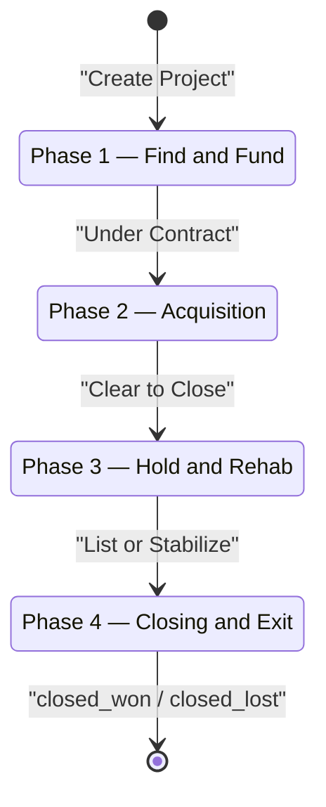
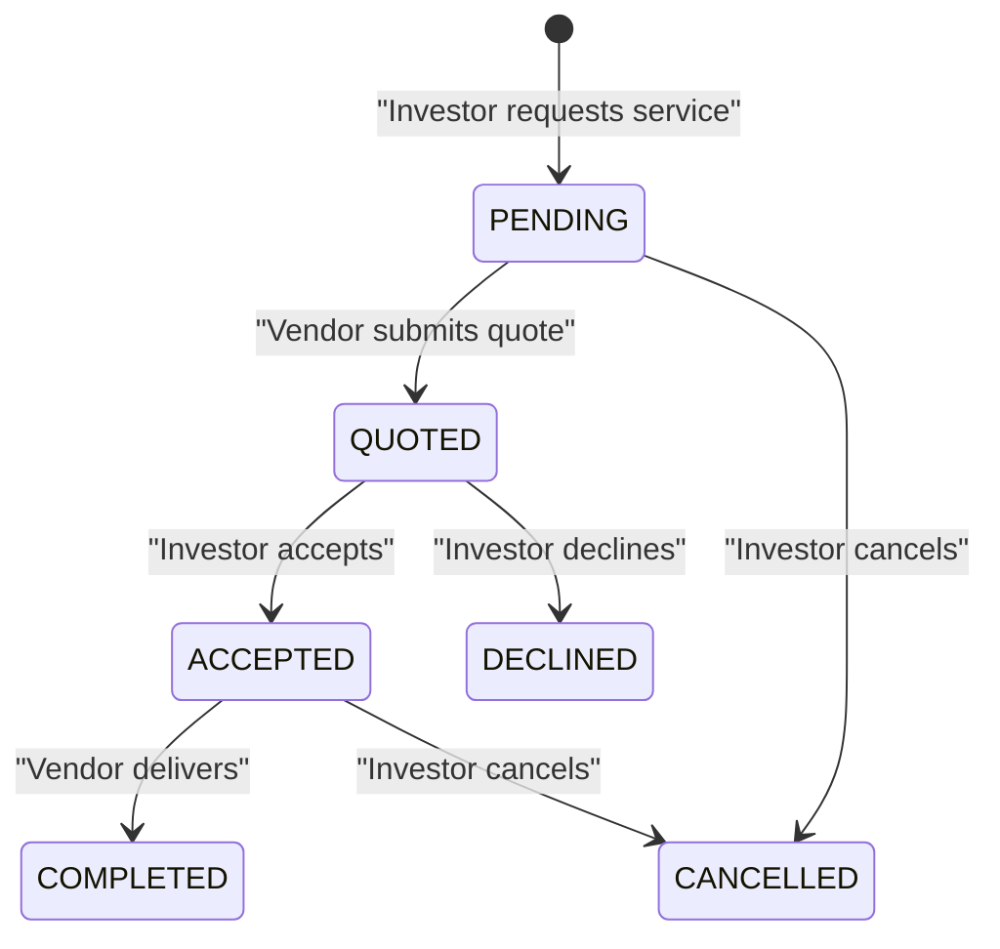
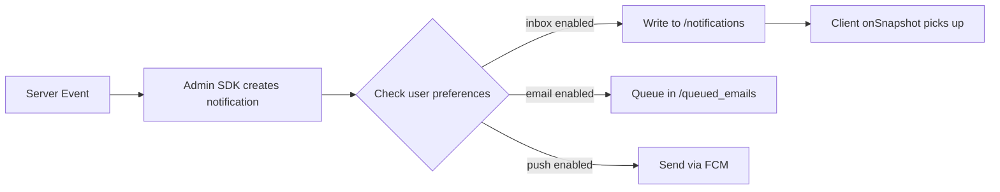

# PaperWorking — Canonical Data Model

> **Owner**: @architect
> **Last updated**: 2026-05-31
> **Schema location**: `src/lib/schemas/`
> **Barrel import**: `import { ... } from '@/lib/schemas'`

## Overview

The PaperWorking data model is centered around a 4-phase real estate investment lifecycle. All schemas are defined as Zod objects in `src/lib/schemas/` and serve as the **single source of truth** for:

1. **Runtime validation** — Firestore reads/writes, API inputs, form submissions
2. **TypeScript types** — All inferred via `z.infer<typeof schema>`
3. **Documentation** — Every field is documented in the schema file

> [!IMPORTANT]
> The existing `src/types/schema.ts` (52KB monolithic file) is NOT deleted.
> 100+ files depend on it. The Zod schemas are the canonical forward reference;
> migration from `types/schema.ts` to `lib/schemas/` is incremental.

---

## Collection Map

| Firestore Path | Schema File | Schema Export | Inferred Type |
|---|---|---|---|
| `/users/{uid}` | `userSchema.ts` | `userSchema` | `User` |
| `/organizations/{orgId}` | `organizationSchema.ts` | `organizationSchema` | `Organization` |
| `/projects/{projectId}` | `projectSchema.ts` | `projectSchema` | `Project` |
| `/propertyMetricSnapshots/{id}` | `propertyMetricSnapshotSchema.ts` | `propertyMetricSnapshotSchema` | `PropertyMetricSnapshot` |
| `/projectFolders/{folderId}` | `projectDocumentSchema.ts` | `projectFolderSchema` | `ProjectFolder` |
| `/projectFiles/{fileId}` | `projectDocumentSchema.ts` | `projectFileSchema` | `ProjectFile` |
| `/projects/{pid}/vendorRequests/{rid}` | `vendorRequestSchema.ts` | `vendorRequestSchema` | `VendorRequest` |
| `/notifications/{notifId}` | `notificationSchema.ts` | `notificationSchema` | `Notification` |
| `/inboxItems/{itemId}` | `inboxItemSchema.ts` | `inboxItemSchema` | `InboxItem` |
| `/stripe_events/{eventId}` | `stripeEventSchema.ts` | `stripeEventSchema` | `StripeEvent` |

---

## Schema Module Summary

### 1. User (`userSchema.ts`)
- **231 lines** | Mirrors `src/types/user.ts`
- Firebase Auth UID as document ID
- Subscription billing fields (Stripe Customer ID, plan, status)
- Notification preferences with per-category routing
- Multi-tenant memberships map
- FCM token array for push delivery

### 2. Organization (`organizationSchema.ts`)
- **169 lines** | Mirrors `src/types/schema.ts` Organization
- Top-level tenant boundary (multi-tenant isolation)
- Team member array with internal roles (CEO, CFO, Deal Lead)
- Fine-grained RBAC permissions enum (18 atomic permissions)
- Portfolio aggregate rollups (updated on project close)

### 3. Project (`projectSchema.ts`)
- **~600 lines** | The largest and most complex schema
- Mirrors the monolithic `Project` + `ProjectFinancials` interfaces
- 4-phase lifecycle: Acquisition → Fund → Hold → Exit
- `currentPhase` is a NUMBER (1-4), NOT a string
- Embedded `financials` object with 100+ financial fields
- All currency in USD dollars (float) — cents migration planned
- Nested schemas: `costEntrySchema`, `settlementLineItemSchema`, etc.

### 4. Property Metric Snapshot (`propertyMetricSnapshotSchema.ts`)
- **~160 lines** | Time-series financial metrics
- 10 core REI metrics (NOI, Cap Rate, CoC, GRM, DSCR, LTV, OER, etc.)
- All metric fields nullable (insufficient data = null)
- Period-keyed: `${projectId}_${YYYY-MM}`
- Investor-scope fields for ownership percentage scaling

### 5. Project Documents (`projectDocumentSchema.ts`)
- **~120 lines** | Filing cabinet (folders + files)
- Phase-based auto-provisioned folders
- Document AI OCR fields (future — `ocrStatus`, `extractedFields`)
- File verification workflow (isVerified, verifiedByUid)

### 6. Vendor Request (`vendorRequestSchema.ts`)
- **~100 lines** | Marketplace pipeline
- **Subcollection** under `/projects/{pid}/vendorRequests/{rid}`
- State machine: PENDING → QUOTED → ACCEPTED → COMPLETED
- `createVendorRequestSchema` for input validation

### 7. Notification (`notificationSchema.ts`)
- **~100 lines** | In-app, email, push notifications
- 14 event types (VENDOR_BID, PHASE_TRANSITION, BURN_RATE_WARNING, etc.)
- Actor + ObjectReference embedded objects
- Three urgency levels: informational, actionable, critical

### 8. Inbox Item (`inboxItemSchema.ts`)
- **~80 lines** | Real-time feed (onSnapshot)
- Universal feed for vendor leads, team invites, system alerts
- Priority levels: low, normal, high, urgent

### 9. Stripe Event (`stripeEventSchema.ts`)
- **~60 lines** | Webhook idempotency log
- Document ID = Stripe event ID (O(1) dedup check)
- Processing status tracking (processed, failed, skipped)

---

## Field Conventions

### Currency
All monetary values are stored as **USD dollar floats** (NOT cents).

```
purchasePrice: 250000     // $250,000.00
loanAmount: 180000        // $180,000.00
```

> [!WARNING]
> A migration to integer cents is planned but NOT yet executed.
> Do not assume cents anywhere in the codebase today.

Exception: `counterPriceCents` is explicitly in cents (integer).

### Percentages
Percentages are inconsistently stored. Each field documents its format:

| Convention | Example | Fields Using It |
|---|---|---|
| Whole number (12.5 = 12.5%) | `12.5` | capRate, cashOnCashReturn, loanInterestRate, vacancyRate, ltv, oer |
| Decimal (0.125 = 12.5%) | `0.125` | ⚠️ `contingencyBufferPercentage` (legacy, avoid) |

### Timestamps
Firestore stores timestamps as `Timestamp` objects. The client hydrates them to `Date`.
All timestamp fields use `z.any()` to accept both:

```typescript
createdAt: z.any(),  // Firestore Timestamp | Date | string
```

### Nullable vs Optional
- `z.nullable()` — The field exists but may be null (e.g. metric snapshots)
- `.optional()` — The field may not exist at all on the Firestore document

---

## Lifecycle State Machines

### Project Phase Lifecycle



### Vendor Request Lifecycle



### Notification Delivery Flow



---

## Multi-Tenant Isolation

Every collection-level document includes an `organizationId` field. Firestore security rules enforce:

```
// Users can only read/write within their own organization
allow read, write: if resource.data.organizationId in request.auth.token.memberships;
```

The tenant boundary hierarchy:
```
Organization (tenant)
  ├── Projects[]
  │     ├── financials (embedded)
  │     ├── members{} (embedded map)
  │     └── vendorRequests/ (subcollection)
  ├── Users[] (via memberships map)
  ├── Notifications[]
  ├── InboxItems[]
  └── PropertyMetricSnapshots[]
```

---

## Test Coverage

Test file: `src/lib/schemas/__tests__/schemas.test.ts`

| Schema | Valid Parse | Invalid Rejection | Edge Cases |
|---|---|---|---|
| userSchema | ✅ | ✅ email, uid | ✅ null email |
| organizationSchema | ✅ | ✅ accountTier, maxSeats | — |
| projectSchema | ✅ | ✅ status, currentPhase, purchasePrice | ✅ cost entries |
| propertyMetricSnapshotSchema | ✅ | — | ✅ null metrics |
| projectFolderSchema | ✅ | — | — |
| projectFileSchema | ✅ | ✅ category, storageUrl | — |
| vendorRequestSchema | ✅ | ✅ status | ✅ quoted fee |
| notificationSchema | ✅ | ✅ type | — |
| inboxItemSchema | ✅ | ✅ priority | — |
| stripeEventSchema | ✅ | ✅ eventId | ✅ processing fields |

---

## Migration Strategy

### Phase 1 (Current): Coexistence
- Zod schemas live in `src/lib/schemas/`
- Legacy types remain in `src/types/schema.ts`
- New code should `import { ... } from '@/lib/schemas'`
- Old code continues using `src/types/schema.ts`

### Phase 2 (Future): Gradual Adoption
- API routes validate inputs with `schema.safeParse()`
- Server actions validate with Zod before Firestore writes
- Form schemas derive from `projectSchema.pick({})`

### Phase 3 (Future): Deprecation
- Generate TypeScript interfaces from Zod schemas
- Replace `src/types/schema.ts` exports with re-exports from `lib/schemas/`
- Remove the 52KB monolithic file

> [!CAUTION]
> Do NOT delete `src/types/schema.ts` until all 100+ import sites are migrated.
> This is a multi-sprint effort coordinated by @architect.
