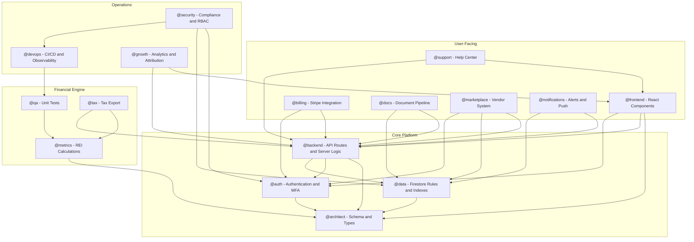
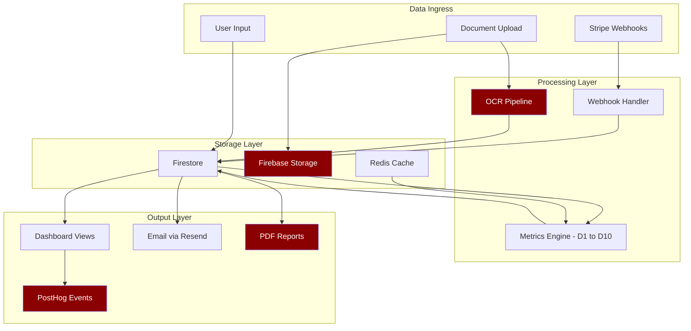

# PaperWorking — Agent Dependency Graph

> **Audited**: 2026-05-31 · **Architect**: @architect

This diagram shows which agents depend on which other agents' work. An arrow `A --> B` means "A's work is blocked by or depends on B completing first."

---

## System Dependency Graph

---

## Critical Path Analysis

The critical path for production readiness flows through these agents in order:

---

## Parallelization Opportunities

These agent groups can work independently:

| Group | Agents | Prerequisite |
|-------|--------|--------------|
| Group A | @data, @auth, @metrics | @architect schema stable |
| Group B | @billing, @tax, @notifications | @backend API routes ready |
| Group C | @growth, @support | @frontend components ready |
| Group D | @security, @devops | Can start after @data and @qa |

---

## Data Flow Between Agents

> [!NOTE]
> Red nodes indicate components that are currently faked or missing.
