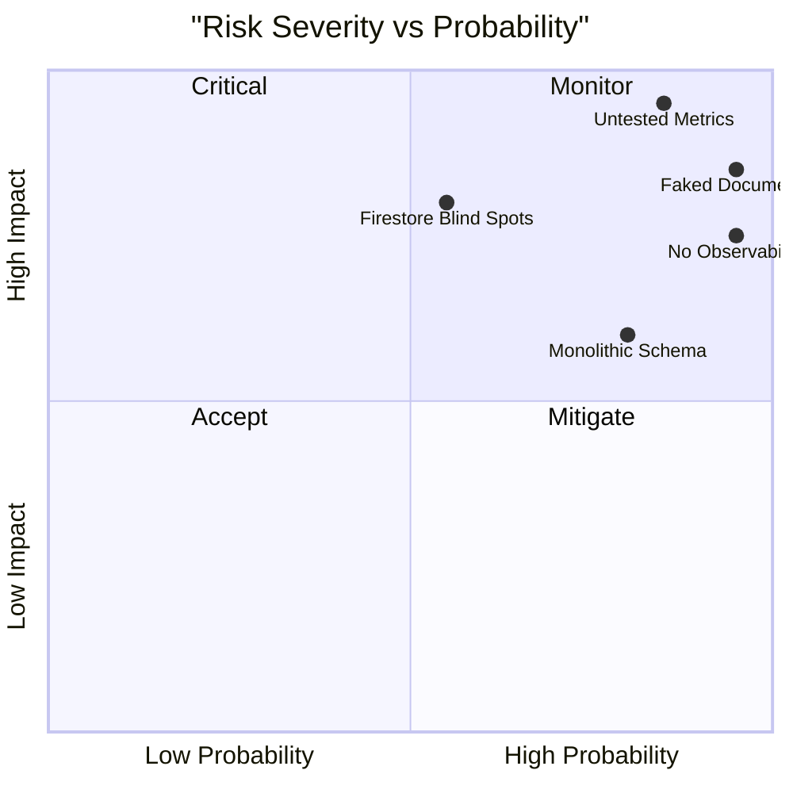

# PaperWorking — Top 5 Architectural Risks

> **Audited**: 2026-05-31 · **Architect**: @architect

---

## Risk 1: Untested Financial Engine Governs Investor Decisions

**Severity**: Critical  
**Probability**: High  
**Impact**: Financial miscalculation leading to bad investor decisions, legal liability

### Description

The metrics engine (`src/lib/metrics/reiMetrics.ts`, 1,396 lines) computes all 10 core REI formulas plus extras including IRR (Newton-Raphson solver), NOI, Cap Rate, CoC Return, DSCR, and more. These calculations directly power the Intelligence dashboard (13 visualization pages) and the Deal Analyzer Terminal (85 KB component).

**Zero unit tests exist.** No test files were found in the entire `src/` directory.

### Load-Bearing Assumptions

- Every formula is assumed correct because it was written once and "looks right"
- `computeIRR()` uses Newton-Raphson iteration — non-convergence cases return `null` but callers may not handle this
- `deriveAllMetrics()` aggregates all metrics — if one sub-function has a bug, all downstream values propagate the error
- Division-by-zero guards exist but are inconsistently applied (some return `0`, some return `null`, some return `Infinity`)

### Mitigation

1. **Immediate**: Create golden test fixtures with hand-verified expected values for all D1–D10 functions
2. **Short-term**: Add property-based tests for invariants (e.g., Cap Rate can never be negative, DSCR > 0 means positive cash flow)
3. **Long-term**: Cross-validate against a second implementation (spreadsheet or third-party API)

---

## Risk 2: 52 KB Monolithic Schema is a Merge Conflict Bottleneck

**Severity**: High  
**Probability**: High  
**Impact**: Every agent touching types will conflict; schema changes become high-risk

### Description

`src/types/schema.ts` is 1,567 lines and 52 KB containing approximately 60 interfaces for all domains: projects, financials, users, vendors, metrics, documents, and more. Every feature change requires editing this single file.

Partial decomposition has started — `user.ts`, `documents.ts`, `inbox.ts`, `notification.ts`, `marketVitals.ts`, `bridge.ts` exist in `src/types/` — but the primary schema remains monolithic.

### Load-Bearing Assumptions

- All agents can coordinate changes to one file without merge conflicts
- TypeScript compiler performance is acceptable with a 52 KB type file
- IDE autocomplete remains responsive (unverified at scale)

### Mitigation

1. Split `schema.ts` into domain modules: `project.ts`, `financials.ts`, `vendor.ts`, `metrics.ts`
2. Keep a barrel `index.ts` re-exporting everything for backward compatibility
3. Use `interface extends` across files rather than inline nesting
4. Assign schema ownership: each agent owns their domain's type file

---

## Risk 3: Document Upload Pipeline is Entirely Faked

**Severity**: High  
**Probability**: Certain (it is currently faked)  
**Impact**: Core SaaS feature non-functional; blocks deal flow for real estate investors

### Description

Document management is central to real estate investing (contracts, inspections, settlement statements, permits). The UI exists — `ProjectCreationWizard.tsx`, `GCBidUploader.tsx`, `ESignAction.tsx` — but every file operation uses `setTimeout` to simulate success:

- No Firebase Storage integration
- No file persistence
- No download capability
- OCR routes return hardcoded data
- E-signature returns after a delay with no actual signing

### Load-Bearing Assumptions

- Users will not notice that uploaded files disappear on refresh
- OCR extraction results are convincing enough in demos
- E-signature status is never actually verified

### Mitigation

1. Prioritize Firebase Storage integration (G-03) as the highest-effort critical gap
2. Implement in phases: (a) basic upload/download, (b) OCR integration, (c) e-signature
3. Add integration tests that verify file persistence round-trip
4. Block production launch until at least basic upload/download works

---

## Risk 4: Firestore Security Has Blind Spots

**Severity**: High  
**Probability**: Medium  
**Impact**: Data exposure or unauthorized access to vendor/support/billing data

### Description

`firestore.rules` is well-structured (242 lines, 14 collections covered) with a catch-all deny rule. However:

1. **9 collections referenced in code have no explicit rules**: `vendorAssignments`, `vendorInbox`, `stripe_events`, `pending_subscriptions`, `support_tickets`, `support_messages`, `teamInvitations`, `queued_emails`, `metricSnapshots`
2. The catch-all deny (`match /{document=**}`) protects these from client access, BUT this assumes they are all server-only (Admin SDK). If any client code attempts reads, it will silently fail.
3. `privateFinancials` read rule is broader than documented — `isInProjectOrg()` allows all org members to read, while the comment says "Only Lead Investor, Accountant, and Lender can read"
4. **No vendor tenant isolation**: A vendor could theoretically read another vendor's assignments if the Admin SDK writes are not properly scoped
5. **Collection naming inconsistency**: `auditLog`, `auditLogs`, `audit_logs` appear in code — some may bypass the defined rules

### Load-Bearing Assumptions

- All 9 unruled collections are exclusively accessed via Admin SDK (never client SDK)
- The `privateFinancials` broad read is intentional and acceptable
- No collection name typos exist that would create unruled access paths

### Mitigation

1. Audit every Firestore call in the codebase to confirm client vs. Admin SDK usage
2. Add explicit deny rules for server-only collections (documentation clarity)
3. Tighten `privateFinancials` read rule to match the documented intent
4. Add Firestore rules unit tests using the Firebase emulator
5. Consolidate duplicate collection names

---

## Risk 5: No Observability Stack Means Blind Production Operations

**Severity**: High  
**Probability**: Certain (nothing is configured)  
**Impact**: Cannot diagnose production issues, cannot measure performance, cannot detect attacks

### Description

The codebase has zero observability infrastructure:

| Layer | Status |
|-------|--------|
| **Logging** | `console.log()` only — no structured logging, no log levels, no PII redaction |
| **Error tracking** | No Sentry, no error boundaries beyond React defaults |
| **APM** | No performance monitoring, no tracing |
| **Analytics** | No PostHog, no Mixpanel, no GA4 |
| **Alerting** | No PagerDuty, no OpsGenie, no alerting of any kind |
| **Uptime** | No uptime monitoring |

### Load-Bearing Assumptions

- Developers will notice production errors by manually checking browser consoles or user reports
- Financial calculation errors will be caught by users before they make investment decisions
- Rate limiting (Redis-backed) will work correctly without monitoring
- The job queue (`src/lib/queue/`) will process all jobs without dropping any

### Mitigation

1. **Week 1**: Sentry for error tracking (G-05) — highest signal-to-effort ratio
2. **Week 2**: Structured logger with PII redaction (G-04)
3. **Week 3**: PostHog for product analytics (G-15)
4. **Week 4**: Uptime monitoring (Checkly, Better Uptime)
5. **Week 5**: APM integration (Sentry Performance or Datadog)

---

## Risk Summary Matrix

---

## Recommended Action Order

| Order | Risk | First Action | Owner |
|-------|------|-------------|-------|
| 1 | Untested Metrics | Write D1-D10 golden tests | @qa |
| 2 | No Observability | Install Sentry | @devops |
| 3 | Faked Documents | Firebase Storage integration | @docs |
| 4 | Firestore Blind Spots | Security rules audit + tests | @data |
| 5 | Monolithic Schema | Split schema.ts into domains | @architect |
