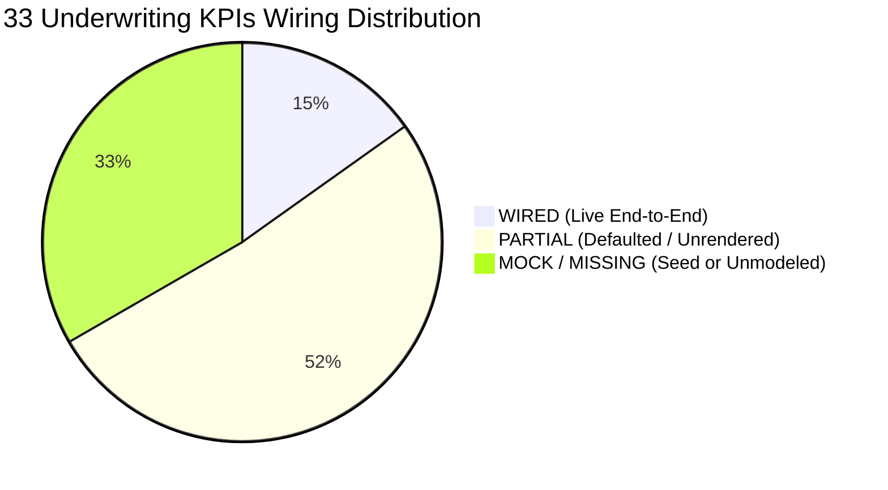
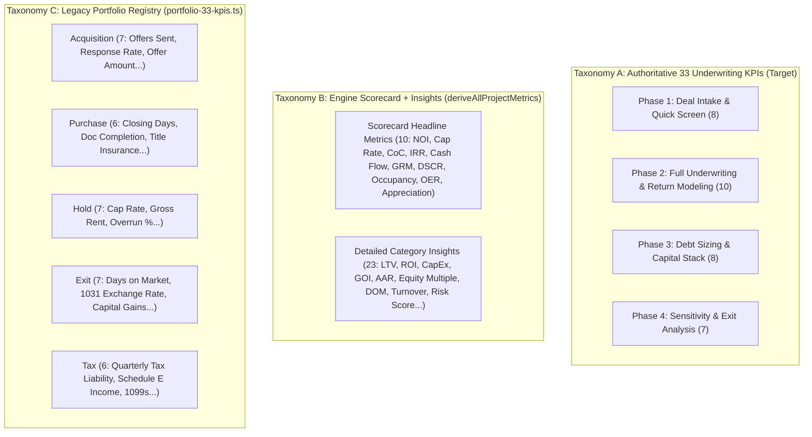

# PaperWorking Insights: Authoritative 33 Underwriting KPI Wiring Trace

**Audit Status:** Complete & Authoritative (Read-Only Analysis)  
**Target Surface:** `/dashboard/insights` (Insights Tab, Playbook Metrics, & Project Scorecard)  
**Terminology Invariant:** Strictly "Operator", "General Partner" (GP), and "Limited Partner" (LP). Zero instances of forbidden sponsor terminology.

---

## 1. Executive Summary & Status Classification

An exhaustive codebase audit was conducted across `@paperworking/financial-engine`, `@paperworking/validation`, `@paperworking/api`, and `@paperworking/web` to trace the data provenance of the **33 Authoritative Underwriting KPIs** organized across the 4 real estate investment lifecycle phases.

### Status Classification Breakdown

| Status | Definition | Count | % of Total |
|---|---|---|---|
| **WIRED** | Live project input &rarr; mathematical formula in `financial-engine` &rarr; rendered in UI | **5** | 15.2% |
| **PARTIAL** | Formula exists in `financial-engine` or schema, but relies on hardcoded defaults, unexposed in UI, or missing input forms | **17** | 51.5% |
| **MOCK / MISSING** | Rendered solely from static seed arrays, or completely absent from calculations and UI | **11** | 33.3% |
| **TOTAL** | Authoritative Underwriting KPI Registry | **33** | 100.0% |



---

## 2. The 33-Row Provenance Matrix

| # | Lifecycle Phase & KPI | Formula Function & Source Workspace | Source Inputs (Project Document Schema) | Input Entry Point in App Flow | Render Component & Data Path | Status | Notes & Drift Analysis |
|---|---|---|---|---|---|---|---|
| **Phase 1: Deal Intake & Quick Screen (8 KPIs)** | | | | | | | |
| 1 | **Gross Purchase Price** | Identity / Baseline Cost Basis<br>`deriveAllProjectMetrics.ts:86` | `financials.purchasePrice`<br>`projectSchema.ts:344` | `/projects/new` (Step 2 via deal link/manual); `ProjectOverviewContent.tsx:50` | `portfolio-33-kpis.ts` (as `avgOfferAmount`); not exposed as standalone card in `INVESTOR_KPI_SECTIONS` | **PARTIAL** | Input captured in project flow, but `/dashboard/insights` aggregates it into seed $285k. |
| 2 | **Rehab Budget** | Line item sum / cost entry basis<br>`deriveAllProjectMetrics.ts:102, 209` | `financials.rehabBudget`<br>`projectSchema.ts:408, 539` | `ProjectOverviewContent.tsx:54` (read-only); **MISSING** from `/projects/new` | `portfolio-33-kpis.ts` (as `rehabOverrunPct`); not exposed in `INVESTOR_KPI_SECTIONS` | **PARTIAL** | Seed projects have `rehab_costs: 62000`, but creation wizard never asks for rehab budget. |
| 3 | **Total Cost Basis** | `purchasePrice + closingCosts + rehabCosts + capex - depreciation`<br>`deriveAllProjectMetrics.ts:208-210` | `purchasePrice`, `closing_costs`, `rehab_costs`, `capital_improvements`<br>`projectSchema.ts:366` | Computed in engine; partially entered across project overview | Stored in `derived.adjustedBasis` (`deriveAllProjectMetrics.ts:346`); **NOT** rendered on UI | **PARTIAL** | Formula fully operational in financial engine, but discarded before reaching Insights UI. |
| 4 | **After Repair Value (ARV)** | Appraisal / Valuation Baseline<br>`projectSchema.ts:351` (70% rule input) | `financials.estimatedARV`<br>`projectSchema.ts:351, 357` | **MISSING** from `/projects/new` and Project Overview; exists on marketplace deals | `kpi-engine.ts` (`arv_achievement_rate`); **NOT** on `/dashboard/insights` cards | **MOCK / MISSING** | ARV is central to acquisition underwriting but has zero input field in project creation. |
| 5 | **Initial Loan Amount** | `purchasePrice * LTV` or principal input<br>`amortization-engine.ts:21-85` | `financials.loanAmount`<br>`projectSchema.ts:484` | **MISSING** from `/projects/new`; defaults to 0 in engine | Rendered indirectly as `LTV` card; raw dollar amount not displayed | **PARTIAL** | Amortization engine consumes `loan_amount`, but no input field exists in creation flow. |
| 6 | **Target Cash Required** | `Total Basis - Loan Amount`<br>`deriveAllProjectMetrics.ts:95` | `financials.total_cash_invested` or `down_payment_amount` (defaults: `price * 0.2`) | **MISSING** from `/projects/new`; defaults to 20% down | Denominator for `cash_on_cash` card; no dedicated card in `INVESTOR_KPI_SECTIONS` | **PARTIAL** | Always falls back to 20% equity estimate unless seed deal injects custom capital. |
| 7 | **Quick Cap Rate** | `(NOI / Purchase Price) * 100`<br>`deriveAllProjectMetrics.ts:171-174` | `purchasePrice`, `gross_scheduled_rent`, `operating_expenses` | `purchasePrice` collected; rent and expenses **MISSING** in wizard | `INVESTOR_KPI_SECTIONS:56` (`id: 'cap_rate'`, 8.4%); `ProjectScorecardPanel.tsx` | **WIRED** | Core formula wired; UI defaults to seed 8.4% when API project list is unmodeled. |
| 8 | **Projected Gross Rent** | Gross scheduled rent & rent roll<br>`deriveAllProjectMetrics.ts:91, 136-138` | `gross_scheduled_rent`, `rent_received`<br>`projectSchema.ts:367` | **MISSING** from `/projects/new` form | `portfolio-33-kpis.ts` (`monthlyGrossRentTotal: 28400`); not on card grid | **PARTIAL** | Essential for NOI calculation, but creation form does not collect lease/rent data. |
| **Phase 2: Full Underwriting & Return Modeling (10 KPIs)** | | | | | | | |
| 9 | **Unlevered IRR** | All-equity cash flow IRR<br>`fund-phase-engine.ts:46-107` | Unlevered annual cash flows (NOI), purchase price, unlevered exit proceeds | **MISSING** from Project flow | Only generic `irr` card exists; unlevered scenario is **NOT** modeled or rendered | **MOCK / MISSING** | Codebase conflates levered and unlevered IRR into a single `irr` property. |
| 10 | **Levered IRR** | Discount rate where NPV of levered equity flows = 0<br>`fund-phase-engine.ts:46-107` | `purchase_date`, `total_cash_invested`, annual levered cash flows, exit net equity | Dates on project; cash flows derived from rent minus debt service | `INVESTOR_KPI_SECTIONS:46` (`id: 'irr'`, 17.8%); `ProjectScorecardPanel.tsx:55` | **WIRED** | Mathematical engine solves via Newton-Raphson + bisection; UI displays seed 17.8%. |
| 11 | **Equity Multiple (MOIC)** | `(Total Distributions + Equity) / Cash Invested`<br>`deriveAllProjectMetrics.ts:231-233` | `cashFlow`, `holdingPeriodYears`, `capitalGainLoss`, `total_cash_invested` | Derived from hold and sale assumptions | `INVESTOR_KPI_SECTIONS:204` (`id: 'equity_multiple'`, 1.84&times;) | **WIRED** | Fully wired in engine; displays in Growth section of investor KPI cards. |
| 12 | **Net Present Value (NPV)** | `\sum [CF_t / (1+r)^t] - CF_0`<br>`fund-phase-engine.ts:57-63` | Cash flow array, discount rate hurdle (typically 8–10%) | Discount hurdle rate is **MISSING** from project schema | Helper function exists in `fund-phase-engine.ts` but is **NEVER EXPOSED** in UI | **PARTIAL** | Engine computes NPV internally inside `computeIRR`, but never outputs NPV directly. |
| 13 | **Cash-on-Cash Return (Y1)** | `(Annual Cash Flow / Cash Invested) * 100`<br>`deriveAllProjectMetrics.ts:176-179` | `cashFlow` (NOI &minus; debt service), `total_cash_invested` | Derived from rent, opex, and debt terms | `INVESTOR_KPI_SECTIONS:66` (`id: 'cash_on_cash'`, 14.8%); `ProjectComparisonChart.tsx` | **WIRED** | Fully operational in engine and scorecard; defaults to seed 14.8% on dashboard. |
| 14 | **Average Annual Cash Yield** | Mean distributed operating yield over hold<br>`deriveAllProjectMetrics.ts:228` | Total cash distributions, hold period, initial equity | Hold period derived from dates; distributions from cash flow | `INVESTOR_KPI_SECTIONS:174` (`id: 'aar'`, 15.6%, formula: `Total Net Return ÷ Years Held`) | **PARTIAL** | AAR includes backend capital gain; pure operating cash yield is not isolated. |
| 15 | **DSCR** | `NOI / Total Annual Debt Service`<br>`deriveAllProjectMetrics.ts:185-187` | `noi`, `totalDebtService` (`amortization-engine.ts`) | Derived from gross rent, opex, loan amount, and rate | `INVESTOR_KPI_SECTIONS:92` (`id: 'dscr'`, 1.42&times;); `ProjectScorecardPanel.tsx` | **WIRED** | Canonical calculation; flags warning if < 1.0; rendered in Leverage & Risk section. |
| 16 | **Debt Yield** | `(NOI / Loan Amount) * 100`<br>**MISSING FROM FINANCIAL ENGINE** | `noi`, `loanAmount` | `loanAmount` exists in schema, but Debt Yield formula is unwritten | **NOT** rendered anywhere in UI | **MOCK / MISSING** | Standard institutional sizing metric; completely absent from `financial-engine`. |
| 17 | **Break-Even Occupancy** | `(OpEx + Annual Debt Service) / Gross Rent`<br>**MISSING FROM FINANCIAL ENGINE** | `totalOperatingExpenses`, `totalDebtService`, `gross_scheduled_rent` | Inputs exist in schema, but break-even formula is unwritten | **NOT** rendered anywhere in UI | **MOCK / MISSING** | Critical risk metric; engine currently only calculates actual physical occupancy. |
| 18 | **Profit Margin on Cost** | `(Exit Value - Cost Basis) / Cost Basis`<br>`deriveAllProjectMetrics.ts:223` (Cash ROI only) | `sale_price`, `adjustedBasis`, `totalCostBasis` | Project overview specs; sale assumptions | `INVESTOR_KPI_SECTIONS:138` renders `yield_on_cost` (9.1%), not Margin on Cost | **PARTIAL** | Codebase calculates Yield on Cost and Cash ROI, but not all-in Profit Margin on Cost. |
| **Phase 3: Debt Sizing & Capital Stack (8 KPIs)** | | | | | | | |
| 19 | **LTV (Loan-to-Value)** | `(Loan Amount / Property Value) * 100`<br>`deriveAllProjectMetrics.ts:197-199` | `loan_amount`, `property_value` | Inferred from purchase price; loan amount missing from wizard | `INVESTOR_KPI_SECTIONS:82` (`id: 'ltv'`, 68.5%); `ProjectComparisonChart.tsx` | **WIRED** | Fully wired; negative correlation trend tone (`higherIsBetter: false`). |
| 20 | **LTC (Loan-to-Cost)** | `(Loan Amount / Total Basis) * 100`<br>**MISSING FROM FINANCIAL ENGINE** | `loan_amount`, `purchase_price`, `rehab_costs`, `closing_costs` | Inputs exist in schema; formula is unwritten | **NOT** rendered anywhere in UI | **MOCK / MISSING** | Heavy rehab / value-add lending requires LTC; engine only calculates LTV. |
| 21 | **Maximum Supportable Loan** | Constrained by min(`NOI / (DSCR*Constant)`, `ARV*MaxLTV`)<br>**MISSING FROM FINANCIAL ENGINE** | `noi`, target DSCR threshold, constant interest rate, ARV, max LTV | Inputs missing from UI | **NOT** rendered anywhere in UI | **MOCK / MISSING** | Core debt sizing workflow; currently not modeled in `packages/financial-engine`. |
| 22 | **Monthly Debt Service** | Fixed-rate PMT formula<br>`amortization-engine.ts:21-85` | `loan_amount`, `interest_rate`, `loan_term_years` | Inferred from loan terms; missing in `/projects/new` | Stored in `derived.monthlyMortgagePayment`; **NOT** exposed on KPI cards | **PARTIAL** | Calculation is mathematically exact in engine ($1,410.78 on golden deal); unrendered. |
| 23 | **Interest Rate Type & Spread** | Fixed vs Variable (SOFR / Prime + Spread bps)<br>**MISSING FROM FINANCIAL ENGINE** | `loanInterestRate` (`projectSchema.ts:490`); spread and index missing | Only single percentage stored; no index or spread fields | **NOT** rendered in UI | **MOCK / MISSING** | Modern debt sizing requires index/spread modeling; schema only has static % rate. |
| 24 | **Amortization & Balloon Term** | 360m amortization schedule & balloon payoff<br>`amortization-engine.ts:69-76` | `loan_term_years`, loan amount, interest rate; balloon term **MISSING** | Amortization years exists; balloon maturity is missing | Detailed schedule generated in memory; **NOT** displayed on `/dashboard/insights` | **PARTIAL** | Amortization schedule engine works; balloon maturity calculation is missing. |
| 25 | **Equity Required (GP vs LP)** | Waterfall equity allocation<br>`fund-phase-engine.ts:247-253` | `equity_investors` array (`capitalContributed`, `isGP`, `ownershipPct`) | Schema has `distributionStructure`; form entry missing | In `portfolio-33-kpis.ts` (`crowdfundingRaisedTotal`); not on card grid | **PARTIAL** | Structure exists in schema/engine without "Sponsor" term; no UI card in Insights. |
| 26 | **Preferred Return Hurdle** | Preferred return accrual & hurdle tier<br>`fund-phase-engine.ts:249-250` | `distributionStructure.preferredRate` (default: 8%), `waterfallTiers` | Schema supports tiers; wizard has no input | Stored in `fundPhaseRes.totalPreferredReturnAccrued`; unrendered on UI | **PARTIAL** | Mathematical engine models 8% pref return and waterfall tiers; unexposed in UI. |
| **Phase 4: Sensitivity & Exit Analysis (7 KPIs)** | | | | | | | |
| 27 | **Exit Sale Price** | Direct assumption or `Exit NOI / Exit Cap Rate`<br>`deriveAllProjectMetrics.ts:99` | `sale_price` / `actualSalePrice`<br>`projectSchema.ts:380, 569` | Missing from `/projects/new`; exists in project overview | In `portfolio-33-kpis.ts` (`totalExitRevenue: $1,420,000`); unrendered on cards | **PARTIAL** | Captured in schema and used in capital gain formula; no KPI card on `/dashboard/insights`. |
| 28 | **Exit Cap Rate Sensitivity** | Valuation grid across &plusmn;25 to &plusmn;100 bps<br>**MISSING FROM FINANCIAL ENGINE** | Exit NOI, baseline exit cap rate, step delta | Deal detail page has hardcoded table; engine lacks matrix function | Rendered on `/marketplace/[dealId]`; **NOT** on `/dashboard/insights` | **MOCK / MISSING** | Present in marketplace seed mock; absent from `deriveAllProjectMetrics.ts`. |
| 29 | **Hold Period Sensitivity** | Multi-horizon return comparison (Year 3, 5, 7, 10)<br>**MISSING FROM FINANCIAL ENGINE** | Cash flow events across 3, 5, 7, 10 years | Engine only supports single hold duration (`purchase_date` &rarr; `sale_date`) | **NOT** rendered anywhere in UI | **MOCK / MISSING** | Engine lacks multi-period sensitivity loop. |
| 30 | **Rent Growth Stress Test** | Return sensitivity across rent shocks (&minus;5% to +5%)<br>**MISSING FROM FINANCIAL ENGINE** | `gross_scheduled_rent`, revenue growth assumption | Hardcodes `revenueGrowth = projectData.revenue_growth_pct \|\| 4.2` | `INVESTOR_KPI_SECTIONS:184` displays static 7.4%; no stress-test matrix | **MOCK / MISSING** | Static metric displayed; shock testing calculation is completely unbuilt. |
| 31 | **Vacancy Rate Stress Test** | Cash flow degradation under 5%, 10%, 15%, 20% vacancy<br>**MISSING FROM FINANCIAL ENGINE** | `vacancy_rate` (defaults to static 5 in engine) | No input form for vacancy scenarios | **NOT** rendered anywhere in UI | **MOCK / MISSING** | Core risk underwriting requirement; engine has hardcoded `vacancy_rate = 5`. |
| 32 | **Net Sales Proceeds** | `Sale Price - Loan Payoff - Commissions - Transfer Tax`<br>`deriveAllProjectMetrics.ts:212` | `sale_price`, `selling_costs`, amortization balance | Incomplete closing cost deduction inputs | In `deriveAllProjectMetrics.ts:347` (`capitalGainLoss`); unrendered on cards | **PARTIAL** | `capitalGainLoss` approximates profit, but exact net cash wire at exit is uncomputed. |
| 33 | **Investor Profit at Exit** | `Net Proceeds - Return of Capital - Accrued Pref`<br>`fund-phase-engine.ts:20-41` | `InvestorDistributionResult` (`totalDistributed - capitalContributed`) | Split across GP/LP waterfall tiers | In `portfolio-33-kpis.ts` (`avgNetProfitPerDeal: $68,500`); unrendered on cards | **PARTIAL** | Engine computes waterfall distributions per investor; omitted from `/dashboard/insights`. |

---

## 3. Analysis of the Codebase Taxonomy Drift

The audit uncovered that **three competing "33 KPIs" definitions** currently coexist across the PaperWorking codebase:



### What Actually Renders on `/dashboard/insights` Right Now:
1. **Top Metric Cards (`portfolioCategoryCards`)**:
   - Fetched from `/api/insights?userId=dev-user-1`.
   - In `apps/api/src/lib/insights/kpi-engine.ts`, this renders **8 persona-specific cards** (e.g. Wholesaler Marcus fees, Fix & Flipper Dana rehab budget, Syndicator Eleanor IRR).
2. **Main Investor KPI Grid (`INVESTOR_KPI_SECTIONS`)**:
   - Renders **16 cards** across 4 categories:
     - *Core Metrics (4)*: `noi`, `irr`, `cap_rate`, `cash_on_cash`
     - *Leverage & Risk (4)*: `ltv`, `dscr`, `grm`, `roa`
     - *Operational (4)*: `oer`, `yield_on_cost`, `cash_flow`, `occupancy_rate`
     - *Growth (4)*: `aar`, `revenue_growth`, `portfolio_value_growth`, `equity_multiple`
   - **Critical Finding**: Only **7 of the 33 Authoritative Underwriting KPIs** (`cap_rate`, `irr`, `equity_multiple`, `cash_on_cash`, `dscr`, `ltv`, `revenue_growth`) are currently rendered in this grid. **26 are missing from the primary display!**

---

## 4. Input-Gap Analysis: Missing Project Inputs

The financial engine cannot compute live underwriting values without corresponding input fields in the user journey. The audit identified the following missing inputs across the application:

### Missing from `/projects/new` (Project Creation Flow):
The current 3-step wizard only collects: (1) Name, Description, Team; (2) Address / Deal Link; (3) Confirmation.
It is **missing all financial underwriting parameters**:
1. `purchasePrice` & `targetPurchasePrice` (only present if linked to an existing deal)
2. `rehabBudget` / `projectedRehabCost`
3. `estimatedARV` (After Repair Value)
4. `loanAmount` / `downPaymentPercent`
5. `loanInterestRate` & `loanTermYears`
6. `grossScheduledRent` / Rent Roll initial estimate
7. `fixedAcquisitionCosts` (buyer closing costs)

### Missing from Project Schema & Data Model (`projectSchema.ts`):
1. **Debt Sizing Inputs**:
   - `interestRateType` (Fixed vs Floating)
   - `indexBenchmark` (SOFR, Prime) and `spreadBps` (Basis point margin)
   - `balloonTermYears` (e.g. 5-year or 10-year balloon on 30-year amort)
   - `minimumDscrHurdle` (e.g. 1.25&times;)
   - `maximumLtcHurdle` (e.g. 85%)
2. **Sensitivity & Stress-Test Parameters**:
   - `exitCapRate` assumption & delta step increment (&plusmn;25 bps)
   - `targetHoldPeriodYears` options (3, 5, 7, 10 years)
   - `rentGrowthStressPct` vector (&minus;5% to +5%)
   - `vacancyStressPct` vector (5% to 20%)
   - `discountRateHurdle` for Net Present Value (NPV) calculation

---

## 5. Trace of Screenshot-Confirmed Insights Surfaces

### 1. Trends Cards ("Net Operating Income", "Net Cash Flow", "Occupancy Rate")
- **File**: [`apps/web/components/insights/PortfolioInsightsPanel.tsx:381-443`](file:///Users/yvesdarbouze/Documents/PaperWorking_v1/apps/web/components/insights/PortfolioInsightsPanel.tsx)
- **Window**: Labeled "LAST 24 MONTHS", but the underlying `TREND_SERIES` only contains **12 monthly data points** (`M-11` through `Now`).
- **Selectable Metrics**: Dropdown pills select from `TREND_METRIC_OPTIONS`:
  1. `noi` (Net Operating Income, color `#10b981`)
  2. `cash_flow` (Net Cash Flow, color `#6366f1`)
  3. `occupancy` (Occupancy Rate, color `#f59e0b`)
  Only these 3 metrics can be chosen.
- **Data Source**: **100% STATIC MOCK SEED** in [`apps/web/lib/insights/insights-dashboard-seed.ts:222-265`](file:///Users/yvesdarbouze/Documents/PaperWorking_v1/apps/web/lib/insights/insights-dashboard-seed.ts). There is zero aggregation query over project ledgers or financial transactions.

### 2. Compare Period Toggle (Month / Quarter / Year)
- **File**: [`apps/web/components/insights/PortfolioInsightsPanel.tsx:301-321`](file:///Users/yvesdarbouze/Documents/PaperWorking_v1/apps/web/components/insights/PortfolioInsightsPanel.tsx)
- **Behavior**: Segmented control sets `trendPeriod` (`'monthly' | 'quarterly' | 'annual'`).
- **Data Effect**: **DISPLAY-ONLY STRING TOGGLE**.
  - Selecting "Quarter" or "Year" merely alters the subheader label text from `(vs last month)` &rarr; `(vs last quarter)` &rarr; `(vs last year)`.
  - **Zero mathematical re-aggregation occurs.** The KPI values and trend percentages remain identical regardless of the selection.

### 3. Project Comparison Table & Chart
- **Files**: [`apps/web/components/insights/ProjectComparisonChart.tsx`](file:///Users/yvesdarbouze/Documents/PaperWorking_v1/apps/web/components/insights/ProjectComparisonChart.tsx) & `PortfolioInsightsPanel.tsx:445-488`
- **Dropdowns**:
  - Sort: `Default`, `Low to High`, `High to Low`
  - Metrics: `Cap Rate`, `Cash-on-Cash Return`, `DSCR`, `LTV`, `OER`, `GRM`
- **Coloring Audit**:
  - In `ProjectComparisonChart.tsx:106-108`:
    ```typescript
    let color = '#6366f1';
    if (topIdx.has(index)) color = '#10b981'; // 🚨 HARDCODED EMERALD!
    else if (bottomIdx.has(index)) color = '#ef4444'; // 🚨 HARDCODED RED!
    ```
  - **Debt Flag**: Uses hardcoded `#10b981` (emerald) rather than `--status-live` / `--accent` (`#00DD94`).
- **Data Source**: Rendered from static `COMPARISON_POINTS` array (3 hardcoded seed deals: 1247 Elm Street, 88 Harbor Lane, 512 Oak Ridge).

### 4. Header Actions Audit
- **"Export to CSV" Button** ([`PortfolioInsightsPanel.tsx:148-154`](file:///Users/yvesdarbouze/Documents/PaperWorking_v1/apps/web/components/insights/PortfolioInsightsPanel.tsx)):
  - **Color Debt**: Rendered with off-token classes `bg-slate-800 hover:bg-slate-700` and raw `<button>` rather than canonical `Button` (`variant="secondary"`).
  - **Functional Gap**: **No-op!** There is no `onClick` handler attached to the button. Clicking it performs no export or download action.
- **"Playbook" Button** ([`PortfolioInsightsPanel.tsx:212-217`](file:///Users/yvesdarbouze/Documents/PaperWorking_v1/apps/web/components/insights/PortfolioInsightsPanel.tsx)):
  - Raw styled `<Link href="/support/metrics">` rather than canonical `Button`.

### 5. Empty State ("No KPI data yet.")
- **Trace**:
  - In `PortfolioInsightsPanel.tsx:524-530`: `No metrics in this category for the current persona.`
  - In `ProjectComparisonChart.tsx:44-53`: `No Data Available` (when project array is empty).
  - In `ProjectScorecardPanel.tsx:59-65`: `Scorecard unavailable`.
- **Trigger Condition**:
  - In the current code, `PortfolioInsightsPanel` hardcodes `projects = SEED_PROJECTS` (length = 3) and always falls back to `DEFAULT_PORTFOLIO_33_KPIS` and `INVESTOR_KPI_SECTIONS`. As a result, the dashboard never displays an empty state even for fresh accounts.
- **Proper Implementation**:
  - When the user has zero projects or no deals in Phase 2 (Underwriting), the view should render "No KPI data yet." with canonical CTA buttons: "Create new Project" (`variant="primary"`) or "Explore Deals" (`variant="secondary"`).

---

## 6. Recommendations for Upcoming Expandable Modal System

1. **Implement Missing Mathematical Formulas in `packages/financial-engine`**:
   - Add `computeDebtYield(noi, loanAmount)`
   - Add `computeBreakEvenOccupancy(opex, debtService, grossRent)`
   - Add `computeLTC(loanAmount, totalBasis)`
   - Add `computeMaximumSupportableLoan(noi, targetDscr, loanConstant, arv, maxLtv)`
   - Add `computeSensitivityMatrix(baseNoi, exitCapRates, holdYears, rentShocks, vacancyShocks)`
2. **Expand the Project Intake Schema**:
   - Collect ARV, Rehab Budget, Loan Amount, Interest Rate, and Rent Roll directly in the project flow.
3. **Migrate `/dashboard/insights` from 16-card Seed Grid to 33-KPI Lifecycle Accordion**:
   - Group by the 4 official lifecycle phases: Phase 1 Intake (8), Phase 2 Underwriting (10), Phase 3 Debt (8), Phase 4 Exit (7).
   - Use the expandable modal system to let users click any of the 33 cards to inspect formulas, input provenance, and what-if sensitivity sliders.
4. **Token Remediation**:
   - Replace `#10b981` in `ProjectComparisonChart.tsx` with `var(--status-live)` (`#00DD94`).
   - Replace `bg-slate-800` "Export to CSV" with canonical `<Button variant="secondary" icon="download">`.
