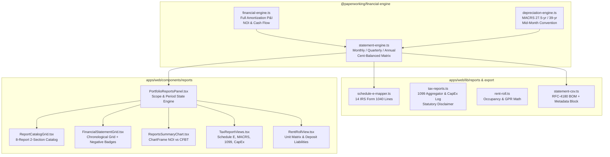

# Walkthrough: Reports Surface Rebuild (Prompt R2)

The `/dashboard/reports` page has been rebuilt into a complete, institutional-grade, chronological P&L and tax reporting command surface. Built on the K/M/V/I foundational infrastructure, it provides multi-period financial statements (Monthly 12-column, Quarterly 4-column, Annual 5-year), CPA-ready tax packages, RFC-4180 CSV export with UTF-8 BOM, and browser-native PDF generation.

---

## 1. Visual Verification & Screenshots

| View | Screenshot Artifact |
| :--- | :--- |
| **Chronological P&L (Monthly 12-Column)** |  |
| **Tax Package (Annual Schedule E & MACRS)** |  |
| **Guided Empty State (Zero Projects)** |  |
| **API Error State (Structured Recovery)** |  |

---

## 2. Architecture & 8-Report Catalog Organization



### 8-Report Catalog

| Section | Report Title | Report ID | Default Granularity | Description |
| :--- | :--- | :--- | :--- | :--- |
| **Core Financial** | **Profit & Loss Statement (P&L)** | `PL` | Monthly | Chronological income statement tracking gross rent, vacancy, operating expenses, debt service, and net cash flow. *(Default view)* |
| **Core Financial** | **Balance Sheet** | `BALANCE_SHEET` | Annual | Real estate assets, accumulated MACRS depreciation, senior debt liabilities, and partner equity accounts. |
| **Core Financial** | **Cash Flow Statement** | `CASH_FLOW` | Monthly | Direct cash movements across Operations, Debt Service Financing, and Capital Expenditures. |
| **Core Financial** | **Rent Roll & Tenant Ledger** | `RENT_ROLL` | Current | Unit-by-unit lease register, market rent comparisons, lease expiries, and deposit liabilities. |
| **Tax Preparation** | **Schedule E Summary** | `SCHEDULE_E` | Annual | IRS Form 1040 Schedule E line-by-line categorization for CPA preparation. |
| **Tax Preparation** | **Depreciation Schedule** | `DEPRECIATION_SCHEDULE` | Annual | Straight-line MACRS asset recovery schedules (27.5-yr residential, 39-yr commercial) with mid-month convention. |
| **Tax Preparation** | **1099 & Vendor Payments** | `FORM_1099_SUMMARY` | Annual | Contractor non-employee compensation ledger aggregating payments $\ge \$600$ for Form 1099-NEC. |
| **Tax Preparation** | **CapEx Log** | `CAPEX_LOG` | Annual | Capital improvements (depreciable basis) vs. repairs & maintenance (current-year expense). |

---

## 3. P&L Statement Row $\to$ Engine Source Mapping Table

Every line item rendered in the Profit & Loss Statement maps deterministically to typed formulas in [`packages/financial-engine`](file:///Users/yvesdarbouze/Documents/PaperWorking_v1/packages/financial-engine):

| P&L Statement Row | Indent Level | Subtotal / Border | Calculation Formula | Engine File & Line Reference |
| :--- | :---: | :---: | :--- | :--- |
| **Gross Scheduled Rent (GSR)** | 0 | None | Base annual gross scheduled potential rent distributed across periods | [statement-engine.ts:L42-L46](file:///Users/yvesdarbouze/Documents/PaperWorking_v1/packages/financial-engine/src/statement-engine.ts#L42-L46) |
| **(−) Vacancy Loss** | 1 | None | `−(GSR * vacancyRate)` | [statement-engine.ts:L47-L50](file:///Users/yvesdarbouze/Documents/PaperWorking_v1/packages/financial-engine/src/statement-engine.ts#L47-L50) |
| **Effective Gross Income (EGI)** | 0 | Top/Bottom Thin | `GSR + Vacancy Loss` (Net rental revenue) | [statement-engine.ts:L51-L54](file:///Users/yvesdarbouze/Documents/PaperWorking_v1/packages/financial-engine/src/statement-engine.ts#L51-L54) |
| **Property Taxes** | 1 | None | `inputs.expenses.taxes` allocated per period | [statement-engine.ts:L56-L59](file:///Users/yvesdarbouze/Documents/PaperWorking_v1/packages/financial-engine/src/statement-engine.ts#L56-L59) |
| **Property Insurance** | 1 | None | `inputs.expenses.insurance` allocated per period | [statement-engine.ts:L60-L63](file:///Users/yvesdarbouze/Documents/PaperWorking_v1/packages/financial-engine/src/statement-engine.ts#L60-L63) |
| **Repairs & Maintenance** | 1 | None | `inputs.expenses.maintenance` allocated per period | [statement-engine.ts:L64-L67](file:///Users/yvesdarbouze/Documents/PaperWorking_v1/packages/financial-engine/src/statement-engine.ts#L64-L67) |
| **Property Management** | 1 | None | `inputs.expenses.management` allocated per period | [statement-engine.ts:L68-L71](file:///Users/yvesdarbouze/Documents/PaperWorking_v1/packages/financial-engine/src/statement-engine.ts#L68-L71) |
| **Utilities** | 1 | None | `inputs.expenses.utilities` allocated per period | [statement-engine.ts:L72-L75](file:///Users/yvesdarbouze/Documents/PaperWorking_v1/packages/financial-engine/src/statement-engine.ts#L72-L75) |
| **Other Operating Expenses** | 1 | None | `security + HOA` expenses | [statement-engine.ts:L76-L80](file:///Users/yvesdarbouze/Documents/PaperWorking_v1/packages/financial-engine/src/statement-engine.ts#L76-L80) |
| **Total Operating Expenses (OpEx)**| 0 | Top Thin | $\sum(\text{Taxes, Ins, Maint, Mgmt, Util, Other})$ | [statement-engine.ts:L81-L85](file:///Users/yvesdarbouze/Documents/PaperWorking_v1/packages/financial-engine/src/statement-engine.ts#L81-L85) |
| **Net Operating Income (NOI)** | 0 | Top/Bottom Double | `EGI − Total OpEx` | [statement-engine.ts:L86-L90](file:///Users/yvesdarbouze/Documents/PaperWorking_v1/packages/financial-engine/src/statement-engine.ts#L86-L90) |
| **Mortgage Interest** | 1 | None | Full amortization monthly schedule interest component | [statement-engine.ts:L92-L95](file:///Users/yvesdarbouze/Documents/PaperWorking_v1/packages/financial-engine/src/statement-engine.ts#L92-L95) |
| **Principal Amortization** | 1 | None | Full amortization monthly schedule principal component | [statement-engine.ts:L96-L99](file:///Users/yvesdarbouze/Documents/PaperWorking_v1/packages/financial-engine/src/statement-engine.ts#L96-L99) |
| **Total Debt Service** | 0 | Top Thin | `Mortgage Interest + Principal Amortization` | [statement-engine.ts:L100-L104](file:///Users/yvesdarbouze/Documents/PaperWorking_v1/packages/financial-engine/src/statement-engine.ts#L100-L104) |
| **Replacement Reserves / CapEx**| 1 | None | `inputs.expenses.capex` allocated per period | [statement-engine.ts:L105-L109](file:///Users/yvesdarbouze/Documents/PaperWorking_v1/packages/financial-engine/src/statement-engine.ts#L105-L109) |
| **Cash Flow Before Taxes (CFBT)**| 0 | Top/Bottom Bold | `NOI − Total Debt Service − CapEx` | [statement-engine.ts:L110-L115](file:///Users/yvesdarbouze/Documents/PaperWorking_v1/packages/financial-engine/src/statement-engine.ts#L110-L115) |

### Cent Distribution Reconciliation
Dividing annual figures by 12 without rounding control causes penny drift (e.g. $\$1,000 / 12 = \$83.33 \times 12 = \$999.96$). `statement-engine.ts` implements `distributeAnnualToMonths(annualValue)`:
- Months $1\dots11$ receive `Math.floor(annualValue / 12 * 100) / 100`
- Month 12 receives `annualValue - sum(Month 1..11)`
- Result: **Zero penny drift** across all periods.

---

## 4. Straight-Line MACRS Depreciation Engine Verification

Implemented in [`packages/financial-engine/src/depreciation-engine.ts`](file:///Users/yvesdarbouze/Documents/PaperWorking_v1/packages/financial-engine/src/depreciation-engine.ts):

### Golden Mathematical Formulas
1. **Land vs Improvement Basis Split:**
   $$\text{Depreciable Basis} = \text{Purchase Price} - \text{Land Value}$$
   *(If land value is missing, the engine strictly raises `INSUFFICIENT_INPUTS` rather than guessing)*
2. **Recovery Periods:**
   - Residential Rental Property: **27.5 years**
   - Nonresidential Real Property (Commercial): **39.0 years**
3. **Mid-Month Convention:**
   - Year 1 Fraction: $\frac{12 - \text{inServiceMonth} + 0.5}{12}$
   - Year 1 Deduction: $\text{Depreciable Basis} \times \frac{1}{\text{Recovery Period}} \times \text{Year 1 Fraction}$
   - Full Intermediate Years: $\frac{\text{Depreciable Basis}}{\text{Recovery Period}}$
   - Final Year: Remaining unrecovered basis.

### Verified Golden Values (Jest Suite)
- **Residential ($1,000,000 Basis, 27.5-yr, In-Service March 15):**
  - Full-Year Annual Depreciation: $\$36,363.64$
  - Year 1 (9.5 months): $\$1,000,000 \times \frac{1}{27.5} \times \frac{9.5}{12} = \$28,787.88$
- **Commercial ($1,560,000 Basis, 39.0-yr, In-Service January 1):**
  - Full-Year Annual Depreciation: $\$40,000.00$
  - Year 1 (11.5 months): $\$1,560,000 \times \frac{1}{39} \times \frac{11.5}{12} = \$38,333.33$

---

## 5. IRS Form 1040 Schedule E Mapping

Implemented in [`apps/web/lib/reports/schedule-e-mapper.ts`](file:///Users/yvesdarbouze/Documents/PaperWorking_v1/apps/web/lib/reports/schedule-e-mapper.ts) with full 14 Form 1040 lines:
- **Line 3:** Rents received
- **Line 5:** Advertising
- **Line 6:** Auto and travel
- **Line 7:** Cleaning and maintenance
- **Line 8:** Commissions
- **Line 9:** Insurance
- **Line 10:** Legal and other professional fees
- **Line 11:** Management fees
- **Line 12:** Mortgage interest paid to banks
- **Line 13:** Other interest
- **Line 14:** Repairs
- **Line 15:** Supplies
- **Line 16:** Taxes
- **Line 17:** Utilities
- **Line 18:** Depreciation expense or depletion
- **Line 19:** Other expenses
- **Line 20:** Total expenses
- **Line 21:** Net rental real estate income / loss

---

## 6. CSV Export Specification & Metadata Header Block

Implemented in [`apps/web/lib/export/statement-csv.ts`](file:///Users/yvesdarbouze/Documents/PaperWorking_v1/apps/web/lib/export/statement-csv.ts):
- **BOM:** `\uFEFF` prepended to eliminate character distortion in Microsoft Excel.
- **RFC-4180 Compliance:** Double quote escaping (`""`) and commas in text cells.
- **Naming Pattern:** `paperworking-{scope-slug}-{report-id}-{granularity}-{YYYY-MM-DD}.csv`
- **Metadata Header Block:**

```csv
# PaperWorking Financial Statement Export
# Report: Profit & Loss Statement (P&L)
# Scope: Portfolio Aggregate (3 properties)
# Period: monthly (FY2026)
# Data Source: Projected (underwriting model)
# Generated: 2026-09-04T13:57:00.000Z
# Disclaimer: For planning purposes — not tax advice. Consult a CPA.
#
Line Item,Jan 2026,Feb 2026,Mar 2026,Apr 2026,May 2026,Jun 2026,Jul 2026,Aug 2026,Sep 2026,Oct 2026,Nov 2026,Dec 2026,Total (FY2026)
"Gross Scheduled Rent (GSR)",10000.00,10000.00,10000.00,10000.00,10000.00,10000.00,10000.00,10000.00,10000.00,10000.00,10000.00,10000.00,120000.00
"(−) Vacancy Loss",-500.00,-500.00,-500.00,-500.00,-500.00,-500.00,-500.00,-500.00,-500.00,-500.00,-500.00,-500.00,-6000.00
...
```

---

## 7. Button Constitution Compliance

- **Populated Surface:** Exactly **0 primary buttons**. All action controls (`Export CSV`, `Print / PDF`, Period Granularity Toggles, Scope Selectors) use `variant="secondary"` (`border border-white/10 bg-white/[0.03] text-slate-300 hover:bg-white/[0.08] hover:text-white`).
- **Guided Empty View:** Exactly **1 primary button** (`Create New Project`, `variant="primary"`).
- **Dead Controls Eliminated:** Print/PDF triggers browser-native `window.print()`.

---

## 8. Test Execution Summary

| Suite | Scope | Tests Run | Result | Notes |
| :--- | :--- | :---: | :---: | :--- |
| **Monorepo Typecheck** | All 7 workspaces | — | **0 Errors** | `tsc -p tsconfig.json --noEmit` clean across packages |
| **Financial Engine Unit Tests** | `packages/financial-engine` | 25 | **25 / 25 PASS** | Covers MACRS depreciation, mid-month, statement matrix, cent distribution |
| **Web Unit Tests** | `apps/web` | 452 | **452 / 452 PASS** | Covers CSV export, tax reports, rent roll, Firestore rules, KPI registry |
| **Playwright E2E Tests** | `tests/e2e/specs/reports.spec.ts` | 8 | **8 / 8 PASS** | Covers Populated, Period Toggle, Scope Selector, Tax Views, CSV Download, WCAG AA a11y, Empty State, Error State |
