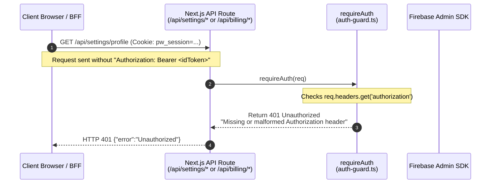
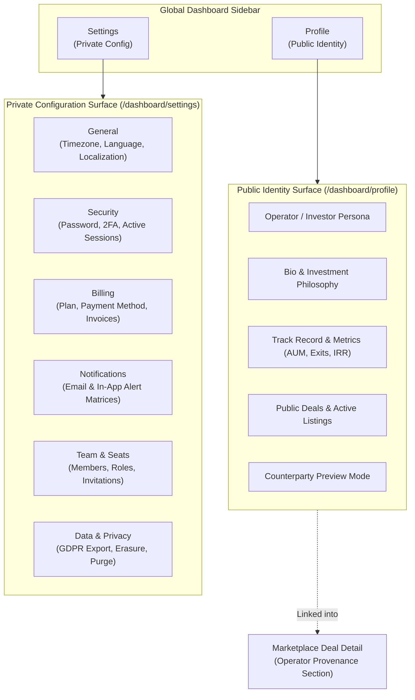

# Settings, Profile & Billing Diagnostic: Architecture & Auth Forensic (Audit S1)

**Audit Date:** September 6, 2026  
**Audited Platform:** PaperWorking_v1 Monorepo (`apps/web`, `@paperworking/api`, `@paperworking/database`)  
**Legacy Reference Platform:** `/Users/yvesdarbouze/Documents/PaperWorking` (Current Production)  
**Classification:** Read-Only Forensic Architecture Audit  
**Artifact Path:** `docs/audits/settings-diagnostic.md`

---

## 1. TL;DR — 5 Core Findings

1. **401 Root Cause is Token-Only Auth Guard in Legacy:** In legacy production, `/api/settings/[[...section]]` and `/api/billing/[[...action]]` invoke `requireAuth(req)` ([`src/lib/firebase-admin/auth-guard.ts:52–60`](file:///Users/yvesdarbouze/Documents/PaperWorking/src/lib/firebase-admin/auth-guard.ts#L52-L60)), which strictly requires an `Authorization: Bearer <idToken>` header. When the client or server-side BFF makes requests without this header (relying solely on cookies or during uninitialized client token state), `requireAuth` immediately rejects with `401 {"error":"Unauthorized"}`. In v1, the routes **do not exist in Next.js App Router at all** (they return 404).
2. **v1 Settings & Billing Surfaces are 100% Mock Stubs:** `GeneralSettingsPanel.tsx`, `ProfileSettingsPanel.tsx`, and `BillingPreviewPanel.tsx` in v1 execute **zero network API calls**. All user mutations (saving profile, updating password, toggling 2FA, revoking sessions, claiming email, GDPR data erasure, workspace deletion) are simulated with client `setTimeout` delays against static seed data (`shell-seed.ts`).
3. **Navigation Architecture is Heavily Duplicated & Fragmented:** The dashboard sidebar defines an `Account` section with `Profile`, `Billing`, and `Settings` ([`nav-contract.ts:74–80`](file:///Users/yvesdarbouze/Documents/PaperWorking_v1/apps/web/lib/navigation/nav-contract.ts#L74-L80)). Inside `/dashboard/settings`, `layout.tsx` re-declares an 8-item subnav that duplicates `Profile` and `Billing`, links out of settings to `Marketplace` and `Team`, and contains 2 disabled stubs (`Notifications`, `Audit Logs`) plus an alias (`Data & Privacy` pointing to Profile).
4. **Counterparty Identity on Marketplace Deals is Static Mock Text:** There is no connection between user accounts and deal provenance. On deal detail pages ([`DealDetailPageView.tsx:621–664`](file:///Users/yvesdarbouze/Documents/PaperWorking_v1/apps/web/components/marketplace/detail/DealDetailPageView.tsx#L621-L664)), Section 4 ("Operator Provenance & Track Record") displays hardcoded static text ("Apex Capital Partners", "$145M+ AUM", "19.2% IRR", "8 Exits"). Counterparties have no way to view an operator's real identity, bio, or verified track record.
5. **Recommended S2 Build Order:**
   - **Step 1:** Establish clear IA separation: **Profile = Public Identity** (Operator/Investor persona, track record, bio, counterparty view) vs. **Settings = Private Configuration** (General, Security, Billing, Notifications, Team, Data & Privacy).
   - **Step 2:** Mount cookie-session-authenticated Next.js route handlers in `apps/web/app/api/settings/...` and `apps/web/app/api/billing/...` using `@paperworking/api` handlers and `requireDevSessionAuth()`.
   - **Step 3:** Wire real persistence for Profile and Settings, removing fake `setTimeout` stubs and dead button controls.

---

## 2. The 401 Root-Cause Chain

### Legacy Production Failure Trace



#### Detailed Evidence:
1. **Route Implementation (Legacy):**
   [`/Users/yvesdarbouze/Documents/PaperWorking/src/app/api/settings/[[...section]]/route.ts:22–24`](file:///Users/yvesdarbouze/Documents/PaperWorking/src/app/api/settings/[[...section]]/route.ts#L22-L24):
   ```ts
   const auth = await requireAuth(request);
   if (isAuthError(auth)) return auth;
   const { uid } = auth;
   ```
2. **Auth Guard Failure (Legacy):**
   [`/Users/yvesdarbouze/Documents/PaperWorking/src/lib/firebase-admin/auth-guard.ts:53–60`](file:///Users/yvesdarbouze/Documents/PaperWorking/src/lib/firebase-admin/auth-guard.ts#L53-L60):
   ```ts
   const authHeader = req.headers.get('authorization') ?? req.headers.get('Authorization');

   if (!authHeader || !authHeader.startsWith('Bearer ')) {
     return NextResponse.json(
       { error: 'Unauthorized', message: 'Missing or malformed Authorization header. Expected: Bearer <idToken>' },
       { status: 401 }
     );
   }
   ```
3. **The Failure Mechanism:**
   - Legacy routes strictly demanded a client-supplied Firebase ID token via HTTP Authorization header.
   - Client pages or server-side BFF utilities fetching profile data failed to pass this header, either because:
     a) The request was initiated before the Firebase Client SDK finished asynchronous initialization (`auth.currentUser.getIdToken()`).
     b) The request was made via server-side rendering where Firebase Client Auth does not exist.
     c) The application transitioned to cookie sessions (`pw_session`), but the legacy API guards were never updated to accept session cookies.

### Status in PaperWorking_v1

- **API Routes Missing from Next.js App Router:**
  In `apps/web/app/api/`, there are **no route handlers** for `/api/settings` or `/api/billing`:
  - `apps/web/app/api/settings/` does NOT exist (returns **404 Not Found**).
  - `apps/web/app/api/billing/` does NOT exist (returns **404 Not Found**).
- **Headless Handlers in `@paperworking/api`:**
  The business logic was ported to `@paperworking/api` as headless functions:
  - [`apps/api/src/routes/settings/handler.ts`](file:///Users/yvesdarbouze/Documents/PaperWorking_v1/apps/api/src/routes/settings/handler.ts) (`handleSettingsGet`, `handleSettingsPut`, `handleSettingsPost`, `handleSettingsDelete`)
  - [`apps/api/src/routes/billing/handler.ts`](file:///Users/yvesdarbouze/Documents/PaperWorking_v1/apps/api/src/routes/billing/handler.ts) (`handleBillingGet`, `handleBillingPost`, `handleBillingPut`, `handleBillingDelete`)
  However, they were never exposed via Next.js App Router routes in `apps/web/app/api/`.
- **v1 Client Components are Fully Disconnected:**
  `GeneralSettingsPanel.tsx`, `ProfileSettingsPanel.tsx`, and `BillingPreviewPanel.tsx` do not make fetch calls to `/api/settings/*` or `/api/billing/*`, masking the missing routes behind mock UI.

---

## 3. Surface & Tab Inventory Table

| Surface / Route | File Location | Status | Type | Summary & Behavior |
| :--- | :--- | :---: | :---: | :--- |
| **Sidebar: Profile** | [`nav-contract.ts:76`](file:///Users/yvesdarbouze/Documents/PaperWorking_v1/apps/web/lib/navigation/nav-contract.ts#L76) | PARTIAL | Nav Link | Routes to `/dashboard/settings/profile`. Duplicates internal Settings subnav. |
| **Sidebar: Billing** | [`nav-contract.ts:77`](file:///Users/yvesdarbouze/Documents/PaperWorking_v1/apps/web/lib/navigation/nav-contract.ts#L77) | PARTIAL | Nav Link | Routes to `/dashboard/settings/billing`. Duplicates internal Settings subnav. |
| **Sidebar: Settings** | [`nav-contract.ts:78`](file:///Users/yvesdarbouze/Documents/PaperWorking_v1/apps/web/lib/navigation/nav-contract.ts#L78) | PARTIAL | Nav Link | Routes to `/dashboard/settings`. Renders General Settings. |
| **Settings: Layout** | [`settings/layout.tsx:1–170`](file:///Users/yvesdarbouze/Documents/PaperWorking_v1/apps/web/app/(dashboard)/dashboard/settings/layout.tsx) | EXISTS | Layout | 8-item subnav, back link, support card, and build identity footer (`data-testid="build-identity-footer"`). |
| **Tab: General** | [`settings/page.tsx`](file:///Users/yvesdarbouze/Documents/PaperWorking_v1/apps/web/app/(dashboard)/dashboard/settings/page.tsx) | PARTIAL | Panel | Renders `GeneralSettingsPanel`. Timezone/language use `localStorage`. Delete account runs fake timer. |
| **Tab: Profile** | [`settings/profile/page.tsx`](file:///Users/yvesdarbouze/Documents/PaperWorking_v1/apps/web/app/(dashboard)/dashboard/settings/profile/page.tsx) | PARTIAL | Panel | Renders `ProfileSettingsPanel`. Personal details, 2FA, password, sessions, and GDPR erasure use fake `setTimeout` stubs. |
| **Tab: Billing** | [`settings/billing/page.tsx`](file:///Users/yvesdarbouze/Documents/PaperWorking_v1/apps/web/app/(dashboard)/dashboard/settings/billing/page.tsx) | STUB | Panel | Renders `BillingPreviewPanel`. Read-only view of `BILLING_PREVIEW` seed data. All action buttons are dead. |
| **Tab: Marketplace** | [`settings/layout.tsx:18`](file:///Users/yvesdarbouze/Documents/PaperWorking_v1/apps/web/app/(dashboard)/dashboard/settings/layout.tsx#L18) | ROUTE JUMP | Nav Link | Exits settings; links to `/dashboard/marketplace` (already present in primary sidebar nav). |
| **Tab: Team** | [`settings/layout.tsx:19`](file:///Users/yvesdarbouze/Documents/PaperWorking_v1/apps/web/app/(dashboard)/dashboard/settings/layout.tsx#L19) | ROUTE JUMP | Nav Link | Exits settings; links to `/dashboard/team` (already present in primary sidebar nav). |
| **Tab: Notifications** | [`settings/layout.tsx:21–26`](file:///Users/yvesdarbouze/Documents/PaperWorking_v1/apps/web/app/(dashboard)/dashboard/settings/layout.tsx#L21-L26) | STUB | Disabled | `disabled: true`, non-clickable grayed-out span in subnav. No route or component exists. |
| **Tab: Data & Privacy** | [`settings/layout.tsx:27–31`](file:///Users/yvesdarbouze/Documents/PaperWorking_v1/apps/web/app/(dashboard)/dashboard/settings/layout.tsx#L27-L31) | ALIAS | Nav Link | Links to `/dashboard/settings/profile` (re-loads Profile page instead of a dedicated privacy surface). |
| **Tab: Audit Logs** | [`settings/layout.tsx:32–37`](file:///Users/yvesdarbouze/Documents/PaperWorking_v1/apps/web/app/(dashboard)/dashboard/settings/layout.tsx#L32-L37) | STUB | Disabled | `disabled: true`, non-clickable grayed-out span in subnav. No route or component exists. |

---

## 4. Dead-Control & Handler Census

Every interactive element across `apps/web/app/(dashboard)/dashboard/settings/` and related panels:

### `GeneralSettingsPanel.tsx` ([`components/settings/GeneralSettingsPanel.tsx`](file:///Users/yvesdarbouze/Documents/PaperWorking_v1/apps/web/components/settings/GeneralSettingsPanel.tsx))
| Element / Control | Line | Handler Present? | Actual Behavior |
| :--- | :---: | :---: | :--- |
| Timezone `<select>` | L176 | Yes (`onChange`) | Updates local React state; written to `localStorage` on save. No API call. |
| Request Language Button | L213 | Yes (`onClick`) | Toggles `showLangRequest` dropdown in local React state. |
| Language Option Buttons (x6) | L228 | Yes (`onClick`) | Writes selected language to `localStorage` (`pw_requested_lang`). No API call. |
| Save Preferences Button | L244 | Yes (`onClick`) | Sets `saved = true` for 3s; writes to `localStorage`. No API call. |
| Delete Account Button | L391 | Yes (`onClick`) | Opens `deleteConfirmOpen` modal in local React state. |
| Reauth Password Input | L179 | Yes (`onChange`) | Stores text in local React state. |
| Verify Password Button | L114 | Yes (`onClick`) | Synthetic delay `setTimeout(400)` setting `reauthVerified = true`. No auth verification. |
| Confirm Deletion Button | L122 | Yes (`onClick`) | Synthetic delay `setTimeout(300)` stepping through 5 mock UI steps (`DELETE_STEPS`). No purge runs. |
| Retry Deletion Button | L361 | Yes (`onClick`) | Sets `jobStatus = 'in_progress'` in local React state. |

### `ProfileSettingsPanel.tsx` ([`components/settings/ProfileSettingsPanel.tsx`](file:///Users/yvesdarbouze/Documents/PaperWorking_v1/apps/web/components/settings/ProfileSettingsPanel.tsx))
| Element / Control | Line | Handler Present? | Actual Behavior |
| :--- | :---: | :---: | :--- |
| **Upload Photo Button** | L158 | **NO (DEAD)** | `<button type="button">` with camera icon has **zero `onClick` handler**. Non-interactive. |
| **Edit Avatar Badge** | L165 | **NO (DEAD)** | Decorative container with edit icon. Non-interactive. |
| Personal Details Form Inputs | L14–17 | Yes (`onChange`) | Updates local React state. |
| Save Profile Changes Button | L55 | STUB | Synthetic delay `setTimeout(400)` setting `saved = true` for 3s. No API call. |
| Password Form Inputs | L21–23 | Yes (`onChange`) | Updates local React state. |
| Show/Hide Password Toggle | L24 | Yes (`onClick`) | Toggles `showPwd` in local React state. |
| Update Password Button | L72 | STUB | Synthetic delay `setTimeout(600)` setting `pwdSuccess = true`. No password change. |
| Toggle 2FA Button | L92 | STUB | Synthetic delay `setTimeout(400)` toggling `mfaEnabled`. No MFA enrollment or OTP challenge. |
| Revoke All Other Sessions | L100 | STUB | Synthetic delay `setTimeout(400)` filtering local `sessions` array. No token revocation. |
| Claim Email Input | L532 | Yes (`onChange`) | Updates local React state. |
| Send Claim Code Button | L539 | STUB | Synthetic delay `setTimeout(500)` setting `claimStep = 'verify'`. No email sent. |
| Verify Claim Code Button | L558 | STUB | Synthetic delay `setTimeout(500)` adding email to local list. No code checked. |
| Request Data Erasure Button | L651 | Yes (`onClick`) | Opens confirmation panel in local React state. |
| Confirm Erasure Request | L122 | STUB | Synthetic delay `setTimeout(300)` setting `isDeletionPending = true`. No GDPR job queued. |
| Cancel Erasure Request | L129 | STUB | Synthetic delay `setTimeout(300)` clearing pending status. |

### `BillingPreviewPanel.tsx` ([`components/dashboard/BillingPreviewPanel.tsx`](file:///Users/yvesdarbouze/Documents/PaperWorking_v1/apps/web/components/dashboard/BillingPreviewPanel.tsx))
| Element / Control | Line | Handler Present? | Actual Behavior |
| :--- | :---: | :---: | :--- |
| **Change Plan Button** | L45 | **NO (DEAD)** | `<button type="button">` has **zero `onClick` handler**. Non-interactive. |
| **Cancel Subscription Button** | L51 | **NO (DEAD)** | `<button type="button">` has **zero `onClick` handler**. Non-interactive. |
| **Update Card Button** | L67 | **NO (DEAD)** | `<button type="button">` has **zero `onClick` handler**. Non-interactive. |
| View Team Plans Button | L124 | Yes (`Link`) | Navigates to `/pricing`. |
| Invoices Table Rows | L105 | **NO (DEAD)** | Displays static rows. No invoice PDF download links or click actions. |

---

## 5. Findings Register

### `F-S1: Auth Architecture Mismatch (Legacy 401 vs v1 Missing Routes)`
- **Severity:** HIGH
- **Evidence:**
  - Legacy `src/lib/firebase-admin/auth-guard.ts:55` requires `Authorization: Bearer <idToken>`. Any request without it receives 401.
  - v1 has migrated handler logic in `@paperworking/api` (`apps/api/src/routes/settings/handler.ts` & `routes/billing/handler.ts`), but **no Route Handlers are mounted in `apps/web/app/api/settings/` or `apps/web/app/api/billing/`**.
  - Requests to these endpoints in v1 return 404.

### `F-S2: Settings Panels are 100% Mock Stubs with Synthetic Delays`
- **Severity:** HIGH
- **Evidence:**
  - `GeneralSettingsPanel.tsx`, `ProfileSettingsPanel.tsx`, and `BillingPreviewPanel.tsx` make zero fetch requests.
  - Profile mutations use `await new Promise((r) => setTimeout(r, 400))` ([`ProfileSettingsPanel.tsx:58`](file:///Users/yvesdarbouze/Documents/PaperWorking_v1/apps/web/components/settings/ProfileSettingsPanel.tsx#L58)).
  - Account deletion simulates 5 steps via `setTimeout` interval ([`GeneralSettingsPanel.tsx:84`](file:///Users/yvesdarbouze/Documents/PaperWorking_v1/apps/web/components/settings/GeneralSettingsPanel.tsx#L84)).
  - No user edits survive page refresh (except timezone/language saved to browser `localStorage`).

### `F-S3: Navigation Duplication and Route-Jumping Tabs`
- **Severity:** MEDIUM
- **Evidence:**
  - Primary sidebar defines `Profile` (`/dashboard/settings/profile`), `Billing` (`/dashboard/settings/billing`), and `Settings` (`/dashboard/settings`).
  - Inside Settings, `layout.tsx:15–38` repeats `Profile` and `Billing`, while adding `Marketplace` (jumping to `/dashboard/marketplace`) and `Team` (jumping to `/dashboard/team`).
  - Settings subnav contains 2 permanently disabled items (`Notifications`, `Audit Logs`) and 1 alias (`Data & Privacy` pointing to `/dashboard/settings/profile`).

### `F-S4: Dead Buttons in Billing and Profile Surfaces`
- **Severity:** MEDIUM
- **Evidence:**
  - `BillingPreviewPanel.tsx`: "Change plan" (line 45), "Cancel" (line 51), and "Update card" (line 67) are plain HTML `<button>` tags with no event listeners.
  - `ProfileSettingsPanel.tsx`: Photo upload button (line 158) has no file input or `onClick` handler.

### `F-S5: Disconnection Between User Identity and Marketplace Deals`
- **Severity:** MEDIUM
- **Evidence:**
  - `apps/api/src/lib/marketplace/investor-mapper.ts` defines rich public profile fields (`displayName`, `businessName`, `publicBio`, `strategies`, `aumCents`, `avgRoiPct`, `dealCount`).
  - In `DealDetailPageView.tsx:621–664`, Section 4 ("Operator Provenance & Track Record") displays hardcoded static text ("Apex Capital Partners", "$145M+ AUM", "19.2% IRR", "8 Exits").
  - Counterparties on Marketplace deals cannot see the actual operator's public identity.

### `F-S6: Unmounted Billing & Stripe Infrastructure`
- **Severity:** MEDIUM
- **Evidence:**
  - `@paperworking/api` contains full headless Stripe routes: checkout ([`apps/api/src/routes/stripe/checkout/handler.ts`](file:///Users/yvesdarbouze/Documents/PaperWorking_v1/apps/api/src/routes/stripe/checkout/handler.ts)), subscriptions ([`subscription/handler.ts`](file:///Users/yvesdarbouze/Documents/PaperWorking_v1/apps/api/src/routes/stripe/subscription/handler.ts)), payment methods ([`payment-method/handler.ts`](file:///Users/yvesdarbouze/Documents/PaperWorking_v1/apps/api/src/routes/stripe/payment-method/handler.ts)), customer portal, and webhooks.
  - None of these are mounted in `apps/web/app/api/stripe/` or `apps/web/app/api/billing/`.

---

## 6. Recommended Information Architecture (IA) Mapping

To eliminate navigation duplication, resolve the 401 bug, and establish a clear separation of concerns, the account surfaces should be divided into **Public Identity** vs. **Private Configuration**:



### Detailed Destination Mapping

| Existing Surface / Element | Current Location | Target IA Location | Target Purpose |
| :--- | :--- | :--- | :--- |
| **Public Persona & Bio** | Scattered in seed-data | `/dashboard/profile` | How counterparties, LPs, and co-sponsors see you on Marketplace deals. Display name, company, avatar, website, location, strategies. |
| **Track Record & Provenance** | Hardcoded in `DealDetailPageView` | `/dashboard/profile` | AUM, historical realized IRR, total exits, public deal count. Feeds directly into deal detail Section 4. |
| **Counterparty Preview** | None (Greenfield) | `/dashboard/profile?view=public` | Real-time preview of how your profile card looks to other marketplace participants. |
| **General Preferences** | `GeneralSettingsPanel.tsx` | `/dashboard/settings` (General tab) | Timezone, locale, language preferences. Persisted to user preferences. |
| **Security & Authentication** | `ProfileSettingsPanel.tsx` | `/dashboard/settings/security` | Password change, TOTP 2FA enrollment, session list and revocation. |
| **Billing & Invoices** | `BillingPreviewPanel.tsx` | `/dashboard/settings/billing` | Active plan, Stripe Customer Portal / Checkout, payment method on file, PDF invoice download. |
| **Alert Preferences** | Disabled stub in `layout.tsx` | `/dashboard/settings/notifications` | Email and in-app toggles for deals, bids, deadlines, and reports. |
| **Team Management** | `/dashboard/team` (duplicate tab in settings) | `/dashboard/settings/team` (or primary `/dashboard/team`) | Single canonical location for seat allocation, invitations, and role management. |
| **Data Control & Erasure** | Mixed into Profile & General panels | `/dashboard/settings/data` | GDPR compliance: data export download and scheduled account/workspace erasure. |
| **Sidebar Entry: Billing** | Separate item in sidebar | **Remove from sidebar**; reside inside `/dashboard/settings/billing` | Eliminates top-level clutter; keeps sidebar focused on primary workspaces. |

---

## 7. Recommended S2 Implementation Plan

1. **Step 1: Mount API Route Handlers in `apps/web/app/api/`**
   - Mount `/api/settings/profile` and `/api/settings/[[...section]]` using `handleSettingsGet/Put` from `@paperworking/api`.
   - Mount `/api/billing/[[...action]]` using `handleBillingGet/Post` from `@paperworking/api`.
   - Authenticate routes using `requireDevSessionAuth()` (`pw_session` cookie) to resolve the root-cause 401 failure permanently.
2. **Step 2: Split Profile into Dedicated Public Surface**
   - Create `/dashboard/profile` for public counterparty identity.
   - Connect Deal Detail Section 4 ("Operator Provenance & Track Record") to read from the deal creator's public profile data.
3. **Step 3: Refactor Settings Layout Subnav**
   - Clean up `NAV_ITEMS`: General, Security, Billing, Notifications, Team, Data & Privacy.
   - Remove route-jumping tabs (`Marketplace`, `Team`) and purge disabled stubs.
4. **Step 4: Wire Real Handlers and Eliminate Dead Controls**
   - Replace fake `setTimeout` promises in Profile and Settings with real API mutations.
   - Wire billing buttons to Stripe checkout / portal sessions.
