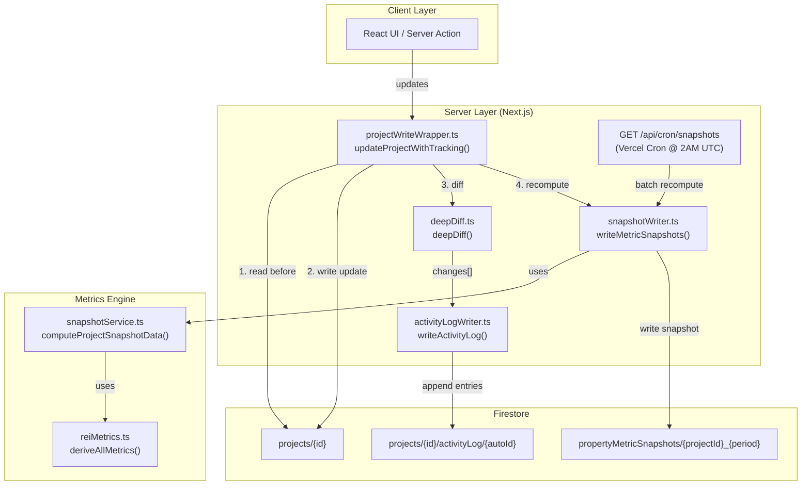

# Snapshot Writer & Activity Log — Architecture

> **Status**: Implemented  
> **Last Updated**: 2026-05-31  
> **Owner**: @backend agent

## Overview

The snapshot writer and activity log system provides two critical backend mechanisms for PaperWorking:

1. **Metric Snapshots** — Recomputes and persists REI metrics (NOI, cap rate, CoC return, DSCR, etc.) whenever project data changes, creating a time-series history in `propertyMetricSnapshots`.

2. **Activity Log** — Append-only audit trail recording every field-level change to a project, stored in `projects/{id}/activityLog/`.

Both mechanisms are triggered **without Cloud Functions** — using Next.js API routes, server actions, and utility wrappers.

---

## Architecture Diagram



---

## Data Flow

### On Every Project Write (Real-time)

```
User action → updateProjectWithTracking()
  ├── 1. Read current project document (before state)
  ├── 2. Apply updates to Firestore (updateDoc)
  ├── 3. Deep diff before/after → FieldChange[]
  ├── 4. writeActivityLog(changes) → projects/{id}/activityLog/
  └── 5. writeMetricSnapshots(afterData) → propertyMetricSnapshots/
```

### Nightly Cron (Batch)

```
Vercel Cron @ 2:00 AM UTC → GET /api/cron/snapshots
  ├── Verify CRON_SECRET bearer token
  ├── Query all active projects (max 100)
  ├── For each project: writeMetricSnapshots()
  └── Return JSON summary: { projectsProcessed, snapshotsWritten, errors }
```

---

## File Reference

| File | Purpose |
|------|---------|
| `src/lib/utils/deepDiff.ts` | Recursive object diff → `FieldChange[]` |
| `src/lib/firebase/activityLogWriter.ts` | Append-only audit log writer |
| `src/lib/firebase/snapshotWriter.ts` | Metric snapshot writer (single + batch) |
| `src/lib/firebase/projectWriteWrapper.ts` | Combined wrapper: write + diff + log + snapshot |
| `src/app/api/cron/snapshots/route.ts` | Nightly cron endpoint |
| `src/lib/metrics/reiMetrics.ts` | Canonical metrics engine (`deriveAllMetrics`) |
| `src/lib/metrics/snapshotService.ts` | Snapshot data computation (`computeProjectSnapshotData`) |

---

## Firestore Collections

### `projects/{projectId}/activityLog/{autoId}`

Append-only subcollection. Each document:

| Field | Type | Description |
|-------|------|-------------|
| `userId` | string | UID of user who made the change |
| `fieldPath` | string | Dot-notation field path (e.g. `financials.purchasePrice`) |
| `oldValue` | any | Previous value |
| `newValue` | any | New value |
| `source` | enum | `manual` / `ocr` / `vendor` / `system` |
| `timestamp` | Timestamp | `FieldValue.serverTimestamp()` |

### `propertyMetricSnapshots/{projectId}_{period}`

Top-level collection with deterministic document IDs. Each document contains all 10+ REI metrics computed from the project's financials at that point in time. See `PropertyMetricSnapshot` type in `src/types/schema.ts`.

---

## Cron Configuration

In `vercel.json`:

```json
{
  "path": "/api/cron/snapshots",
  "schedule": "0 2 * * *"
}
```

| Setting | Value |
|---------|-------|
| Schedule | Daily at 2:00 AM UTC |
| Auth | `Authorization: Bearer $CRON_SECRET` |
| Max projects | 100 per invocation |
| Max duration | 60 seconds |
| Idempotent | Yes (uses `merge: true` on snapshot docs) |

**Required env var**: `CRON_SECRET` must be set in Vercel project settings.

---

## Integration Points in `deals.ts`

The following functions in `src/lib/firebase/deals.ts` are write paths that should be wired to the tracked wrapper:

| Function | Line | Current Write | Integration Strategy |
|----------|------|---------------|---------------------|
| `createProject()` | 97 | `setDoc(newDoc, {...})` | Call `writeMetricSnapshots()` after `reconstructHistoryForProject()` |
| `updateProject()` | 133 | `updateDoc(dealRef, {...})` | **Primary target** — replace with `updateProjectWithTracking()` |
| `updateLedgerItem()` | 188 | `updateDoc(itemRef, {...})` | Trigger snapshot recompute after ledger change |
| `closeProjectAndArchive()` | 307 | `updateDoc(dealRef, {...})` | Call `writeActivityLog()` with close event + snapshot |
| `capturePhaseSnapshot()` | 397 | `updateDoc(dealRef, {...})` | Call `writeActivityLog()` for phase transition |

### Example: Wiring `updateProject()`

The client-side `deals.ts` uses the client Firebase SDK. For server-side tracked writes, use the wrapper from a server action:

```ts
// src/actions/projects.ts
'use server';

import { updateProjectWithTracking } from '@/lib/firebase/projectWriteWrapper';

export async function updateProjectAction(
  projectId: string,
  userId: string,
  updates: Record<string, any>
) {
  return updateProjectWithTracking(projectId, userId, updates, 'manual');
}
```

---

## Testing

Tests use Jest with `@swc/jest` transformer (see `jest.config.js`):

```bash
npx jest --testPathPattern="deepDiff|activityLogWriter|snapshotWriter"
```

| Test File | Covers |
|-----------|--------|
| `src/lib/utils/__tests__/deepDiff.test.ts` | Nested diffs, arrays, nulls, dates, type changes |
| `src/lib/firebase/__tests__/activityLogWriter.test.ts` | Batch writes, source types, sanitization |
| `src/lib/firebase/__tests__/snapshotWriter.test.ts` | Snapshot doc format, merge writes, metric summary |
