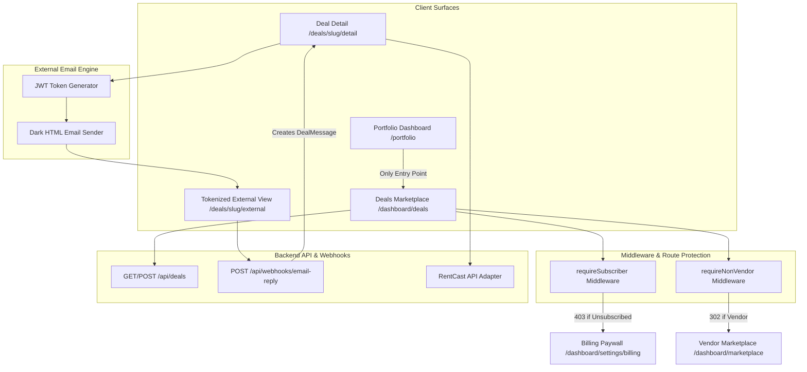
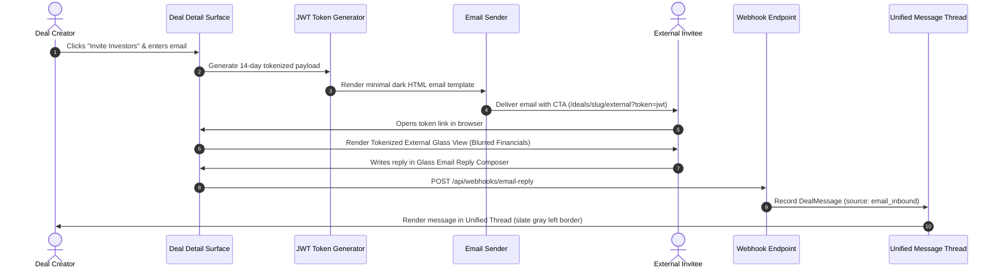

# PaperWorking Deals Marketplace Architecture & Documentation

## Overview
The **PaperWorking Deals Marketplace** is a high-performance, subscription-gated crowdfunding and real estate deal discovery platform built for real estate investors under the **Luminous Glass Design System**.

---

## 1. System Architecture

---

## 2. API Route Table

| Endpoint | Method | Access Guard | Description |
|---|---|---|---|
| `/api/deals` | `GET` | `requireSubscriber`, `requireNonVendor` | Retrieves published deals or user activity deals with filtering, sorting & search. |
| `/api/deals` | `POST` | `requireSubscriber`, `requireNonVendor` | Creates a new deal draft or published listing with pro-forma underwriting. |
| `/api/deals/[slug]` | `GET` | `requireSubscriber`, `requireNonVendor` | Fetches single deal detailed metrics, pro-forma calculations, and RentCast AVM estimates. |
| `/api/webhooks/email-reply` | `POST` | Public Webhook (JWT verified) | Ingests inbound email POST replies from external invitees and creates `DealMessage` records. |

---

## 3. User Role Matrix

| Surface / Action | Investor (Active Subscription) | Investor (Unsubscribed) | Vendor Role | External Invitee (Tokenized) |
|---|---|---|---|---|
| **Portfolio Entry CTA** | Visible & Active | Visible (Paywall Trigger) | Hidden / Stripped | N/A |
| **Discover Tab** | Full Access | 403 Paywall Redirect | Redirect to Vendor Marketplace | N/A |
| **Deal Detail Financials** | Unlocked | Blurred + Paywall Overlay | Redirect to Vendor Marketplace | Blurred + Paywall Overlay |
| **Submit Commitment** | Allowed | Paywall Restricted | Restricted | Paywall Restricted |
| **Email Reply Composer** | N/A | N/A | N/A | Allowed via Tokenized View |

---

## 4. Email Invitation & Webhook Data Flow

---

## 5. Luminous Glass Design System Compliance Checklist

- [x] **Dark Canvas Background**: `#0a0a0f` base canvas on all surfaces.
- [x] **Glass Surface Panels**: `backdrop-filter: blur(12px–20px)`, `border: 1px solid rgba(255,255,255,0.06–0.10)`, `bg-[#0a0a0f]/80–90`.
- [x] **Primary Accent Accentuation**: `#34d399` teal fill for primary action buttons, active filter chips, progress bar fills, positive ROI metrics.
- [x] **Translucent Ghost Buttons**: `bg-[#34d399]/[0.08] border border-[#34d399]/25 text-[#34d399]`.
- [x] **Rounded Corner Standards**: `10px` for buttons & inputs, `12px–14px` for cards & accordions, `16px` for modals & popovers.
- [x] **Mobile First Design**: Sticky top search bar, sticky bottom glass CTA, 72px bottom navigation drawer compatibility.
- [x] **Zero Solid White Fills**: No plain `#ffffff` backgrounds or heavy drop shadows anywhere.
