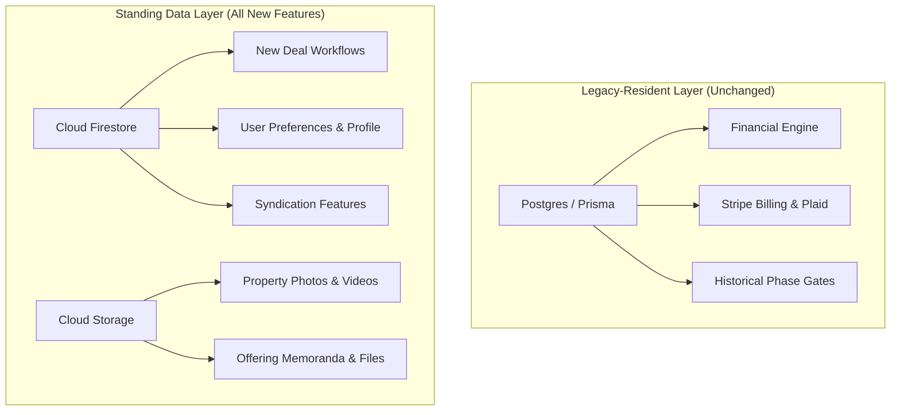
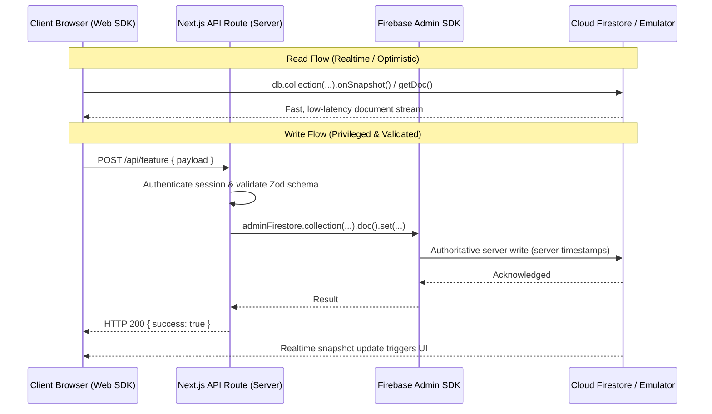

# PaperWorking Standing Firebase Engineering Conventions

**Status**: Active & Mandatory for all new development  
**Target Scope**: All new features, data entities, and media uploads going forward  
**Architecture Policy**: Dual-Stack Resident (Postgres legacy-resident; Firebase forward-standing)

---

## 1. Architectural Boundary: WHEN to Use Firebase

1. **All New Development**: Every new feature, data entity, and user workflow must persist data in **Cloud Firestore** (or **Cloud Storage** for binary assets).
2. **Postgres / Prisma is Legacy-Resident**:
   - Existing core systems (financial engine calculation models, historical project ledgers, Plaid connections, and billing pipelines) remain on their current Postgres/Prisma schemas untouched.
   - **No new tables, schemas, migrations, or relational columns** may be added to Prisma.
   - Zero feature migrations: existing features stay on their resident data layer; nothing new gets built on it.



---

## 2. Read / Write Architectural Topology: HOW to Interface

PaperWorking enforces a strict **Client-Read / Server-Write** architectural topology.



### Key Principles:
1. **Client SDK (`apps/web/lib/firebase/client.ts`)**:
   - Lazy, browser-only singleton.
   - Used for **realtime subscriptions (`onSnapshot`)** and optimistic local reads.
   - May read public or authenticated collections permitted by `firestore.rules`.
   - **Never performs direct privileged writes** to shared or financial collections.
2. **Admin SDK (`apps/web/lib/firebase/admin.ts`)**:
   - Server-only singleton with strict server-boundary guard (`typeof window === 'undefined'`).
   - **All privileged writes, mutations, state transitions, and audit logs** MUST execute through API routes using the Admin SDK.
   - Bypasses client security rules safely after authoritative server validation (Zod schemas, role-based authorization, session checks).
3. **Per-User Documents**:
   - Keyed strictly by `uid`: `/users/{uid}/[collection]/[docId]`.
   - The user owns their document space (`isOwner(uid)`), enforced at the rules level.
4. **Conflict Resolution**:
   - **Server is the authoritative source of truth** (server-wins conflict resolution), adhering to the pattern established in saved-deals profile synchronization.
   - Local state / localStorage serves solely as an optimistic, write-through cache.

---

## 3. Schema & Naming Conventions

1. **Field Casing**: All Firestore document fields MUST be formatted in `camelCase` (e.g., `dealId`, `targetIrr`, `minInvestment`, `equityMultiple`).
2. **Timestamps**:
   - Always use server-generated timestamps for auditing:
     ```ts
     import { FieldValue } from 'firebase-admin/firestore';
     const payload = {
       ...data,
       createdAt: FieldValue.serverTimestamp(),
       updatedAt: FieldValue.serverTimestamp(),
     };
     ```
   - Never accept client-submitted timestamps for audit or transaction ordering.
3. **Institutional Real Estate Terminology**:
   - Use **"Operator"**, **"General Partner" (GP)**, **"Issuer"**, or **"Syndicator"**.
   - **NEVER use "Sponsor"** in any Firestore collection name, document field, type definition, or user-facing copy.

---

## 4. Cloud Storage Bucket Conventions

All binary assets (property photography, aerial footage, offering memoranda, due diligence packets, user avatars) uploaded to Cloud Storage MUST adhere to the standardized 3-tier hierarchical path structure:

```
{domain}/{entityId}/{kind}/{filename}
```

### Approved Path Hierarchy:

| Domain | Entity ID | Kind | Example Path | Permitted Formats | Access Policy |
| :--- | :--- | :--- | :--- | :--- | :--- |
| **`deals`** | `{dealId}` | `media` | `deals/deal-1247-elm/media/hero.webp` | WebP, JPEG, PNG, MP4 | Authenticated Read; Server Write |
| **`deals`** | `{dealId}` | `documents` | `deals/deal-1247-elm/documents/om-v2.pdf` | PDF, XLSX, DOCX | **Revoked (P-03 Closure)** — Server API & $\le 15$-min Signed URLs Only |
| **`projects`** | `{projectId}` | `*` | `projects/proj-123/documents/...` | Any | Server API & $\le 15$-min Signed URLs Only |
| **`orgs`** | `{orgId}` | `*` | `orgs/org-alpha/assets/logo.png` | Any (<50MB) | Matching `organizationId` / `orgId` Token Claim |
| **`temp`** | `{uid}` | `*` | `temp/usr_123/upload-staging.pdf` | Any (<25MB) | Staging Quarantine: Owner Read/Write |
| **`users`** | `{uid}` | `avatar` | `users/usr_abc123/avatar/photo.png` | PNG, JPEG, WebP (<5MB) | Authenticated Read; Owner Write |
| **`vendors`** | `{vendorId}` | `licenses` | `vendors/vnd_summit/licenses/insurance.pdf` | PDF, PNG | Confidential; Server / Owner Write |

---

## 5. Security Rules Architecture (`firestore.rules`)

Security rules operate on a strict **Default-Deny** foundation. Every collection added in future features must be deliberately mapped to one of three approved patterns:

### Pattern A: Per-User Documents (Owner Read/Write)
```javascript
match /users/{uid} {
  allow read, write: if request.auth != null && request.auth.uid == uid;
  match /{userDoc=**} {
    allow read, write: if request.auth != null && request.auth.uid == uid;
  }
}
```

### Pattern B: Authenticated-Read / Server-Write
```javascript
match /deals/{dealId} {
  allow read: if request.auth != null;
  allow write: if false; // All writes enforced through Admin SDK in API routes
}
```

### Pattern C: Fully Private Server-Only
```javascript
match /internal/{docId} {
  allow read, write: if false;
}
match /audit_logs/{docId} {
  allow read, write: if false;
}
```

---

## 6. Testing Conventions & Local Emulators

1. **Emulator-Only Invariant**:
   - Automated tests and local development MUST interact with the **Firebase Emulator Suite** (`FIRESTORE_EMULATOR_HOST=127.0.0.1:8080`, `FIREBASE_STORAGE_EMULATOR_HOST=127.0.0.1:9199`).
   - If an automated test attempts to connect to a live Google Cloud / Firebase project, the Admin SDK singleton is engineered to **throw a fatal error immediately**. Tests must never silently hit production or live dev projects.
2. **Rules Unit Testing**:
   - Every newly created Firestore collection must be accompanied by unit tests using `@firebase/rules-unit-testing` validating:
     - Anonymous requests denied.
     - Non-owner requests denied.
     - Direct client writes to server-managed collections denied.
3. **Playwright Integration**:
   - Playwright end-to-end suites test full browser flows against the Next.js API layer. Because the API layer proxies writes through the Admin SDK, Playwright contracts remain stable and decoupled from internal database topology.
