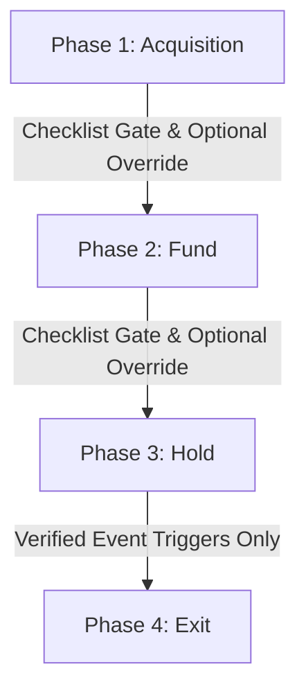

# PaperWorking Engineering & Architectural Specification v1

**Status:** Approved Reference
**Date:** 2026-07-20
**Target Audience:** Engineering, DevOps, and Quality Assurance Teams

---

## 1. Executive Summary & Core Philosophy

### What is PaperWorking?
`PaperWorking` is a premium, real-time project management and deep financial analytics platform built specifically for Real Estate Investors (REIs). Unlike generic project management tools (e.g., Trello, Asana) or static spreadsheet models, PaperWorking bridges the gap between active project coordinate pipelines and downstream financial reporting. 

### The Core Philosophy
> *"Investors participate in the Deal; you command the Project."*

Every real estate asset on the platform is represented by two logical boundaries:
1. **The Project**: The private, multi-phase operational container managed by the **Lead Investor** and their **Investment Team**. This is where schedules, loan records, raw transactions, due diligence, and vendor contracts are managed.
2. **The Deal**: The public-facing or investor-facing presentation of the property (identified by its physical address). This boundary governs soft-commitments, non-binding Letters of Intent (LOIs), and investor-specific distribution tracking.

### The Governing User Story
> *"Without me doing anything, visualize how well my investments are doing."*

To satisfy this story, PaperWorking enforces a strict **Zero-Duplication** policy:
* Any data point that can be programmatically fetched (e.g., AVMs from RentCast), parsed from a uploaded document (e.g., Settlement Statements via OCR), or imported from bank feeds (e.g., bank transactions via Plaid) must be captured automatically.
* Manual inputs are restricted to atomic, non-derivable variables.
* The application interface utilizes **progressive disclosure** (TurboTax-style conversational cards) to collect data step-by-step, ensuring that investors are never presented with massive, overwhelming forms.

---

## 2. The Real Estate Investment Lifecycle (REIL) Model

PaperWorking structures all projects around the canonical four-phase **REIL** model. A project exists in exactly one of these phases at any given time.

### Phase 1: Acquisition
* **Objective**: Target identification, deal analysis, under-contract checklist management, and due diligence.
* **Key Tasks**: Evaluating purchase criteria, executing contract contingencies (appraisals, inspections, title searches), and logging initial earnest money deposits (EMD).
* **Data State**: Highly assumption-driven. Most financials are classified under `projected` slots.

### Phase 2: Fund
* **Objective**: Capital stack assembly, investor onboarding, and transaction closing.
* **Key Tasks**: Securing debt financing (conventional, hard money, bridge, or SBA 504), structuring equity splits (co-buyer TIC/JTWROS or GP/LP syndication structures), collecting investor commitments, and reconciling sources-and-uses at the closing table.
* **Data State**: Transition from projected inputs to verified commitments.

### Phase 3: Hold
* **Objective**: Property operations, renovation tracking, and asset management.
* **Key Tasks**: Execution of renovation budgets (Stage, Refurbish, Renovate, Gut, Develop), tenant leasing, and Schedule E operating expense ledger tracking.
* **Data State**: Actual operating metrics (rental income, utilities, maintenance fees) populate the engine.

### Phase 4: Exit
* **Objective**: Investment realization, disposition execution, and final distributions.
* **Key Tasks**: Property sale execution (or stabilization via commercial lease/stabilized hold), equity multiple payout actualization, and archiving closing documents.
* **Data State**: Finalized transaction actuals. The project becomes read-only and is locked from further mutations.

---

## 3. Phase Transitions & Gate Gating

Transitions between lifecycle phases are strictly governed to maintain database integrity and ensure projects do not advance without sufficient records.

### Checklist-Gated Transitions (Acquisition ➔ Fund ➔ Hold)
The transition from **Acquisition to Fund** and **Fund to Hold** are evaluated from live database records.
1. **Live Checklists**: The backend scans project fields (e.g., verified purchase contract, confirmed earnest money credit, approved financing modality).
2. **Hard Block vs. Override**: Failing critical checklist items blocks transition. However, the Lead Investor can proceed by inputting a typed `overrideReason` which is permanently stored in the project record and displayed on the dashboard alert banners.
3. **Reference**: Evaluation checks are executed server-side via `/api/projects/[id]/route.ts` and synced to the client card UI.

### Event-Driven Auto-Advance (Hold ➔ Exit)
The transition from **Hold to Exit** cannot be triggered manually by clicking a button. It is strictly event-driven:
* The system monitors database entries.
* If a **first confirmed rent payment**, an **activated lease document**, or a **sale contract under contract** is registered in the database, a background listener advances the project to Phase 4 (Exit) automatically.
* **Reference**: Handled by the auto-advance route in [`src/app/api/projects/[id]/hold/auto-advance/route.ts`](file:///Users/yvesdarbouze/Documents/PaperWorking/src/app/api/projects/[id]/hold/auto-advance/route.ts).

---

## 4. The Data Model & Variable Registry

To prevent stale or duplicated values, the application utilizes a structured variable registry mapping atomic input slots to calculated metrics.

### Projected vs. Actual Dual-Slotting
Variables are stored with dual-slot architecture:
* `projectedPurchasePrice` vs. `actualPurchasePrice`
* `projectedRehabCost` vs. `actualRehabCost`
* `projectedRent` vs. `actualRent`

As the project traverses the REIL, computations transition from referencing the projected slot to the actual slot once the transaction passes the closing gate.

### Source Tagging
Every variable in the Firestore and Postgres layers carries a source metadata tag:
* `user_assumption`: Stored manually from conversational forms.
* `user_actual`: Confirmed closing figures or manual ledger entries.
* `document`: Extracted via document parser (e.g., HUD-1 Settlement statement).
* `derived`: Computed automatically by the metrics engine.
* `plaid`: Imported directly from integrated bank statements.

### Schedule E Expense Registry
To align financial dashboards with annual IRS reporting, PaperWorking strictly tracks operating expenses under exactly eight canonical Schedule E categories:
1. `tax` (Real Estate Taxes)
2. `insurance` (Hazard & Liability Insurance)
3. `security` (Property security systems/monitoring)
4. `maintenance` (Repairs & recurring maintenance)
5. `utilities` (Water, sewer, gas, trash, electricity)
6. `management` (Property management fees)
7. `HOA` (Homeowners Association fees)
8. `capex` (Capital expenditure reserves)

> [!IMPORTANT]
> The **Management Fee** is always calculated as a percentage of the **gross scheduled rent**, never effective rent or net rent (BUG-8 Engine Rule).

---

## 5. The Metrics Engine (`deriveAllProjectMetrics`)

To prevent discrepancies across dashboards, reports, and emails, PaperWorking enforces the **Single-Function Rule**:
> *All metric math must live inside `deriveAllProjectMetrics`. No inline arithmetic calculations are permitted in components or API routes.*

The metrics compiler aggregates inputs and computes the **33 core variables** on the fly, feeding the headline scorecard and insights panels.

### The Canonical 10 Scorecard Metrics
The engine prioritizes and displays the following ten metrics:
1. **Net Operating Income (NOI)**: Gross scheduled rent minus operating expenses (Schedule E categories).
2. **Annual Cash Flow**: NOI minus annual debt service.
3. **Cap Rate**: NOI divided by current property value.
4. **Cash-on-Cash Return**: Annual cash flow divided by total cash invested.
5. **Gross Rent Multiplier (GRM)**: Property value divided by gross scheduled rent.
6. **Debt Service Coverage Ratio (DSCR)**: NOI divided by annual debt service.
7. **Internal Rate of Return (IRR)**: Solved iteratively from year 0 to year 5 cash flows.
8. **Occupancy Rate**: Total leased days divided by total active days.
9. **Operating Expense Ratio (OER)**: Total operating expenses divided by gross operating income.
10. **Long-Term Appreciation**: Compounded property value growth over a 10-year hold.

### The Debt Amortization Schedule
To support debt metrics, the shared amortization utility computes debt payments using exact-arithmetic models:
* Monthly P&I is calculated as:
  $$M = P \frac{r(1+r)^n}{(1+r)^n - 1}$$
  Where $P$ is the loan amount, $r$ is the monthly interest rate, and $n$ is the total term in months.
* The output is aggregated to compute the exact **Annual Debt Service** which is fed directly into `deriveAllProjectMetrics`.
* **Reference**: [`src/lib/metrics/reiMetrics.ts`](file:///Users/yvesdarbouze/Documents/PaperWorking/src/lib/metrics/reiMetrics.ts)

---

## 6. Access Control & Permissions Matrix (v1.1)

Next.js API routes and server actions bypass client-side rules. To enforce security, all mutating API endpoints verify user tokens against the project membership database to resolve and enforce roles.

| Role | Permissions | Mutating Scope |
|---|---|---|
| **Lead Investor** | Owner level. Full read, write, and gating override access. | Complete project dataset. |
| **General Contractor** | Operational partner. Full read and write access on construction/milestone scopes. | Phase 3 Hold (Renovations, inspections, and checklist updates). |
| **GP / Co-buyer** | Equity partner. View access for all financials; editing permissions restricted unless explicitly granted in `phasePermissions` configuration. | Scoped to active phase flags. |
| **LP (Limited Partner)** | Passive equity member. Scoped to view their own subscription commitments and upload signature evidence. | Limited to their own `EquityParty` records. Project-wide financials are hidden/read-only. |
| **Vendor** | Scoped service provider (e.g. appraiser, title officer). Read-only access to basic project parameters; write access restricted strictly to their assigned slot. | Only their specific assigned variables (e.g., `f4AppraiserVendor` can upload appraisal documents). |
| **Observer** | Read-only access. Forbidden from mutating any records or invoking phase transitions. | None. |

* **Reference**: Auth checks are evaluated synchronously using `determineAccessAndRole` and `authorizeProjectMutation` inside [`src/lib/firebase-admin/project-guard.ts`](file:///Users/yvesdarbouze/Documents/PaperWorking/src/lib/firebase-admin/project-guard.ts).

---

## 7. Core Integrations & Webhooks

### 1. RentCast API (Property & Rental Comparables)
* **Auth**: Authenticated via server-side header `X-Api-Key`. Keys are server-side only and never leaked to the client bundles.
* **Caching Layer**: Responses are cached in Firestore under `/rentcast_cache/{query}` with a per-endpoint Time-To-Live (TTL) to respect rate limits and reduce recurring API expense.
* **Accuracy fallback**: Standard requests default `lookupSubjectAttributes` to true; custom parameters (radius, comparable counts) are exposed as fallback overrides.

### 2. Document E-Signature (DocuSign/E-Sign)
* **Interface Pattern**: Follows a vendor-agnostic provider interface structure. A mock adapter is maintained to allow local development and E2E testing without active credentials.
* **Webhook Reconciler**: Reconciling signatures relies on async webhooks. Once a user executes a document on the signature portal, DocuSign transmits a callback packet verifying status `Completed` which updates the database. Fake client-side timers to mimic completion are strictly forbidden.

### 3. Plaid Transaction Ledger
* **Reconciliation Ledger**: The system pulls financial transactions, matches them against Schedule E tags, and displays them inside the aggregated ledger table.
* **Modality Archive Guard**: Changing project modality (e.g. from Conventional Financing to All Cash) triggers a guarded sweep. The system identifies now-orphaned documents (e.g., loan records, capital sources) and updates their state to `'Archived'` (maintaining history without deleting records).

---

## 8. Verification & QA Gateways

Every pull request or candidate build is validated against deterministic fixture parameters to ensure calculation models remain unbroken:
1. **The Live Golden Check**: Running `npm test` triggers assertions against the golden values derived from `DEMO_FINANCIALS`. Any variance in NOI, Cap Rate, or Cash Flow fails the pipeline build.
2. **Defect Registry**: Any adversarial QA finding is logged in `docs/evidence/qa-defect-register.md`. Remediations must be committed individually and marked FIXED with their respective commit hashes in the register.
