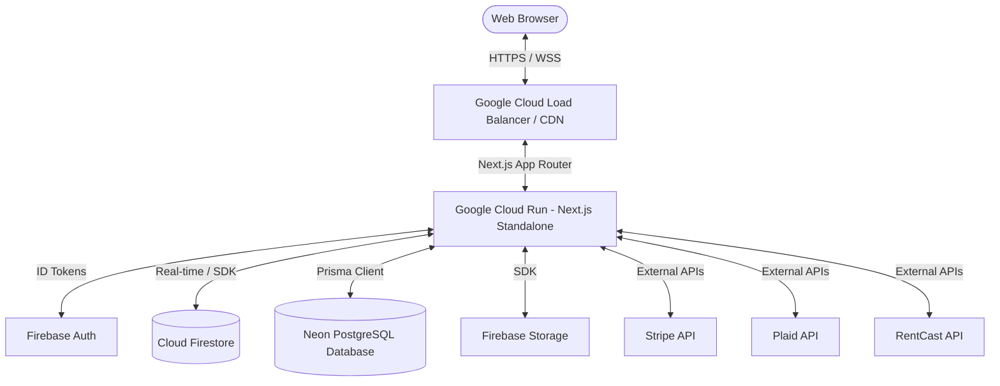

# PaperWorking — Real Estate Investment Operating System
## Technical Specification & Architectural Blueprint
*Version 4.0 · Last Updated: July 1, 2026*

---

## 1. Document Overview & Executive Summary

### 1.1 Purpose
This document provides a comprehensive technical specification of the **PaperWorking** application. It is designed to serve as the master technical blueprint for engineering teams onboarding to the project or deploying integrations. It describes the technology stack, system architecture, database models, third-party vendor interfaces, compliance guardrails, and core application modules.

### 1.2 Platform Vision
PaperWorking is a specialized real estate investment operating system that automates the lifecycle of property acquisition, management, optimization, and exit. By wrapping property analytics, financial ledgers, vendor collaboration, and document management under a single interface, it enables investors to run multi-family and residential portfolios with institutional-grade discipline.

---

## 2. Core Technology Stack

### 2.1 Frontend & Application Layer
*   **Framework**: Next.js 16 (React 19, App Router with Server Actions).
*   **Styling**: Vanilla CSS utilizing custom HSL design tokens for dark/light mode toggles (governed by the Global Navigation Contract).
*   **State Management**: Zustand (client-side stores for active project, UI, and user configuration).
*   **Icons & Visuals**: Google Material Symbols and Lucide React.
*   **Data Fetching**: SWR (Stale-While-Revalidate) for API polling, and native Firebase real-time listeners for data synchronization.

### 2.2 Database & Storage Layer
*   **Primary Database (NoSQL)**: Cloud Firestore (projects, organization metadata, user profiles, notifications, support tickets).
*   **Relational Database (SQL)**: Neon Serverless PostgreSQL managed via Prisma ORM (used primarily for bulk active listings, location searches, and high-frequency lead sourcing).
*   **File Storage**: Firebase Storage (structured project folders for document hubs, photography uploads, and secure lender packages).

### 2.3 Hosting & Deployment
*   **Runtime Host**: Google Cloud Run (Docker-containerized standalone Next.js builds).
*   **Region**: `us-east4` (Northern Virginia).
*   **Continuous Deployment**: Google Cloud Build triggered from configuration templates (`cloudbuild.yaml`).
*   **Edge Middleware**: Next-Firebase-Auth-Edge handles Firebase JWT token validation and mirrors them to `__session` cookies for Server-Side Rendering (SSR).



---

## 3. Authentication & Security Architecture

### 3.1 Firebase Edge Authentication
All security boundaries enforce JWT verification. The authentication flow is divided between the client bundle and secure server contexts:
1.  **Client-Side Login**: Firebase Client SDK authenticates credentials and retrieves a high-level ID token.
2.  **Edge Session Management**: The client posts the token to `/api/auth/session`, which sets a secure, HTTP-only, SameSite=Strict cookie (`__session`).
3.  **Server Actions Guarding**: Every server action calls a helper `getCallerUid()` which decodes the `__session` cookie to verify the caller's identity before interacting with the database.

### 3.2 Tenant Isolation
Multi-tenant isolation is enforced at the document level:
*   Users are associated with an `organizationId` inside their user document.
*   Every query on project collections must filter explicitly by `organizationId` to prevent cross-tenant data leaks.
*   Scoped team members (e.g. property managers) are restricted via a `membershipScopes` object in Firestore, restricting their access to specific list of `assignedProjectIds`.

---

## 4. Third-Party API Integrations

### 4.1 Plaid Integration (Lite & Standard)
Plaid synchronizes bank feeds directly into property expense ledgers:
*   **Authentication**: Plaid Link triggers client-side, generating a `public_token` sent to `/api/plaid/exchange` to acquire an `access_token` stored securely in Firestore.
*   **Synchronization**: A daily cron job triggers transaction fetching. Inbound transactions are run through an automatic classification engine mapping them to 10 canonical Real Estate Investment (REI) expense categories.
*   **Mock Fallback**: Governed by the `PLAID_PROVIDER` environment variable (value: `plaid` or `mock`). 

### 4.2 RentCast API Integration
RentCast provides property-specific market data (AVMs, sale/rental listings, and historic trends):
*   **Authentication**: Secure header validation via `X-Api-Key` managed strictly on the server-side.
*   **Caching Strategy**: All RentCast responses are cached in Firestore with a configured TTL (Time-To-Live) of 30 days to optimize rate limits (20 requests/second) and lower billing overheads.
*   **AVM Point & Range**: UI surfaces must present the low/high confidence range rather than a single points value to comply with the platform's **Honesty Rule**.

### 4.3 DocuSign Connect Integration
DocuSign manages e-signatures for closing disclosures and investor commitments:
*   **Webhook Security**: DocuSign Connect sends status updates using HMAC-SHA256 signatures in the `X-DocuSign-Signature-1` header, which are validated against the `DOCUSIGN_WEBHOOK_HMAC_KEY`.
*   **Asynchronous Reconciliation**: Updates write the envelope status directly to the `esign_envelopes` sub-collection, which triggers a reactive Firestore function to update the main project status.

### 4.4 Resend Integration
All email notifications are dispatched via Resend:
*   **Delivery Webhooks**: Resend callbacks (e.g. `email.sent`, `email.opened`, `email.bounced`) are sent to `/api/webhooks/resend`.
*   **Webhook Security**: Webhook payloads are verified using the Svix signature headers (`svix-signature`, `svix-id`, `svix-timestamp`) to prevent spoofed delivery events.

### 4.5 Stripe Billing Integration
*   **Subscription States**: Multi-tier access levels (None, Standard, Professional, Institutional) mapped to Stripe Subscription items.
*   **Idempotency**: Webhook handlers record processed Stripe event IDs in the `stripe_events` Firestore log to guard against duplicate triggers.

---

## 5. Primary Application Modules

### 5.1 Dashboard & Portfolio CommandCenter
*   **Default Landing Route**: `/dashboard/command-center` (Governed by the Global Navigation Contract).
*   **KPI Panel**: Computes and displays the 10 primary deal-making metrics (NOI, Cap Rate, Cash-on-Warm, IRR, DSCR, LTV, GRM, Occupancy, Expense Ratio, Net Profit).
*   **Dynamic Rollups**: Aggregate metrics across the portfolio are strictly weighted (e.g., portfolio Cap Rate is computed as `Total NOI / Total Property Value`, rather than a simple mathematical average of individual project Cap Rates).

### 5.2 Sourcing & Lead Intake
*   **Lead Search**: Integrates RentCast active listings queries, filterable by Zip Code, City, and State.
*   **Manual Lead Modal**: Form allows manual lead creation, writing immediately to Firestore `/projects/{projectId}` with status `'Lead'`, which automatically updates the pipeline view via real-time hooks.

### 5.3 Attention Engine & Alerts
*   **Location**: Insights workspace.
*   **Operation**: Evaluates the state of all properties against configuration rule sets (e.g. expected-vs-actual rent records).
*   **Missed-Rent Alert**: Automatically triggers an alert card in the Inbox if rent is not reconciled within 5 days of its expected due date. Governed by the Honesty Rule (displays "no matching transaction observed" rather than claiming default). Gated to prevent triggers on Short-Term Rentals (STRs).

### 5.4 Reports & Tax Exporters
*   **Tax Ledger Preview**: Renders a live table preview of Schedule E and cash flow statements.
*   **Export Actions**: Compiles client-side data into highly structured, tax-ready CSV strings for immediate local download.
*   **PDF Statements**: Formats the DOM layout into print-ready media templates using `window.print()` wrappers.

---

## 6. Firestore Database Schema & Schema Map

### 6.1 User Document (`/users/{uid}`)
```typescript
interface UserProfile {
  uid: string;
  email: string;
  displayName: string | null;
  role: 'Lead Investor' | 'Admin' | 'Standard' | 'Vendor';
  accountType: 'investor' | 'vendor';
  organizationId: string;
  personalOrganizationId: string;
  stripeCustomerId?: string;
  subscriptionPlan: 'None' | 'Standard' | 'Professional' | 'Institutional';
  subscriptionStatus: 'active' | 'trialing' | 'past_due' | 'canceled';
  createdAt: Timestamp;
}
```

### 6.2 Project Document (`/projects/{projectId}`)
```typescript
interface Project {
  id: string;
  organizationId: string;
  name: string;
  address: string;
  status: 'Lead' | 'Under Contract' | 'Hold' | 'Exit';
  phase: 'acquisition' | 'closing' | 'rehab' | 'exit';
  currentPhase: 1 | 2 | 3 | 4;
  financials: {
    purchasePrice?: number;
    estimatedARV?: number;
    monthlyGrossRent?: number;
    loanAmount?: number;
    loanInterestRate?: number;
    loanTermYears?: number;
  };
  actionItems: Array<{
    id: string;
    label: string;
    assignee?: string; // target email address
    status: 'pending' | 'completed';
  }>;
  createdAt: Timestamp;
}
```

### 6.3 Sub-Collections
*   **Vendor Assignments**: `/projects/{projectId}/vendorAssignments/{assignmentId}`
    *   Tracks assignments, quote messages, timeline, and professional details.
*   **Document Vault**: `/projects/{projectId}/documents/{documentId}`
    *   Tracks file sizes, paths, categories, and DocuSign metadata.

---

## 7. Mandatory Design & Compliance Policies

### 7.1 The Honesty Rule (Data Integrity)
Any system surface displaying computed metrics, integrations, or data states MUST adhere to the Honesty Rule:
1.  **No Fabricated Fallbacks**: If Plaid data or a database metric is not available, the UI must render an honest empty/warning badge. It must never fabricate dummy data (e.g. displaying `$0` or `0.00%` when input data is missing).
2.  **Confidence Disclosure**: AVM ranges from RentCast must show upper and lower boundary bounds.

### 7.2 GDPR Account Deletion Cascade
Account deletion (via `/api/account/data/delete`) triggers a complete transactional deletion cascade across Firestore:
1.  User profile document.
2.  All pending invitations in the `teamInvitations` collection.
3.  All pending invitations in the investor `invitations` collection.
4.  All files associated with the user in Firebase Storage.
5.  Organization team members list updates to remove the target user.

### 7.3 Global Navigation Contract
The persistent left-side sidebar (defined in `src/components/layout/Sidebar.tsx`) must retain its route sequences exactly:
*   **Primary Pages**: Portfolio (`/dashboard/command-center`), Projects (`/dashboard/projects`), Insights (`/dashboard/insights`), Reports (`/dashboard/reports`), Inbox (`/dashboard/inbox`), Team (`/dashboard/team`).
*   **Account Pages**: Profile (`/dashboard/settings/profile`), Billing (`/dashboard/settings/billing`), Settings (`/dashboard/settings`).
*   **Theme Control**: Controlled via `data-theme` attribute on the root HTML tag.
